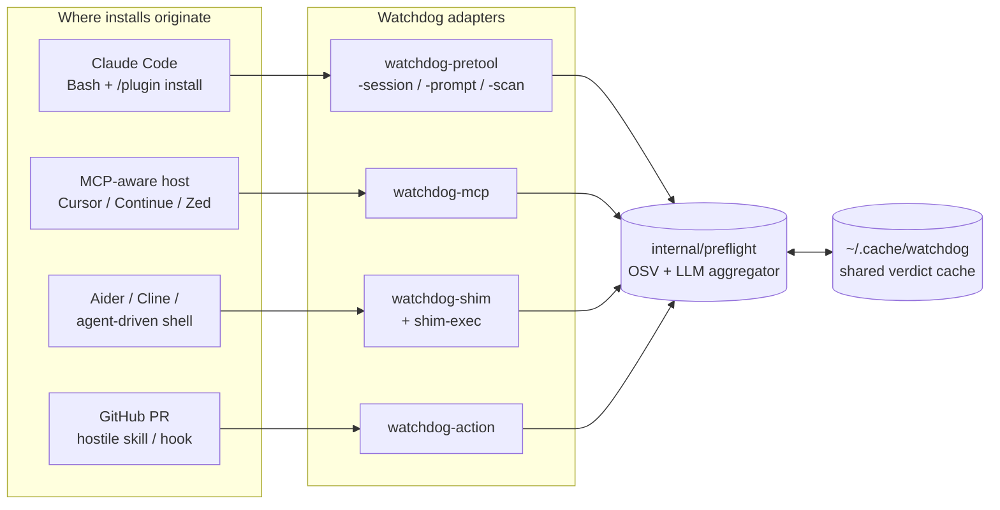

<div align="center">

# Watchdog

Checks package installs before they actually run. When an AI agent decides to `npm install` something for you (or `pip`, `cargo`, `gem`, `bun`, etc.), Watchdog intercepts the command, asks OSV.dev about known CVEs, and optionally feeds the artifact to your configured LLM for a source review. You get `allow`, `ask`, or `deny` back before anything lands on disk.

Static Go binary. Linux, macOS, Windows.

Works with Claude Code, Claude Desktop, Cursor, Continue, Zed, OpenCode, Aider, Cline, and plain shells that an agent happens to be driving.

[](https://go.dev/)
[](LICENSE)
[](#testing)
[](#engine)

</div>

---

## What it's for

`npm audit`, Snyk, and Dependabot all inspect manifest edits in your repository. They don't see the install command an agent types at a prompt. They also don't see a plugin that drops a hostile skill into `~/.claude/` or wherever your host stores extensions.

Watchdog sits in front of that. The check runs in two stages:

1. OSV.dev lookup. Cached, parallel, no LLM involved.
2. If OSV is clean, an LLM source review on a curated subset of the artifact's files. The model is asked to look for typosquats, malicious `postinstall` scripts, obfuscated payloads, credential-stealing skills, and so on.

Worst verdict across the packages in a command wins. If OSV is unreachable, the LLM CLI isn't installed, or the analyzer times out, the default is `ask`. There's no path where Watchdog silently allows something it couldn't check.

Beyond the verdict, an Ed25519-signed integrity manifest detects tampering with Watchdog's own state — binaries, shim wrappers, decision tokens. The hook wrappers fail-closed on tamper instead of silently passing. See [Tamper resistance](#tamper-resistance).

If you already have something covering manifest edits in PRs, this isn't a replacement for that. It covers the surface those tools weren't built for.

---

## Quick start

Three commands:

```bash
# 1. Install the binaries.
curl -fsSL https://raw.githubusercontent.com/Maxlemore97/Watchdog/main/install.sh | sh

# 2. If the installer warned about PATH, fix it. Then install the
#    package-manager shims. On a TTY, this also generates the local
#    Ed25519 signing keypair and prompts to wire up any detected
#    MCP-aware hosts (Claude Desktop, Cursor, Continue, Cline, Zed).
#    Use --no-register to skip the prompt; --register (or -y) to
#    accept without prompting.
export PATH="$HOME/.local/bin:$PATH"
watchdog-shim install

# 3. Put the shim dir at the FRONT of your PATH (the previous step
#    prints the exact line), open a new shell, then check.
export PATH="$HOME/.watchdog/bin:$PATH"
watchdog-shim doctor
```

Healthy `doctor` output:

```
watchdog-shim doctor:
  ok  shim dir is first on PATH
  ok  watchdog-shim-exec found on PATH
  ok  at least one LLM provider CLI on PATH
  ok  cache dir writable (/home/you/.cache/watchdog)
  ok  integrity manifest matches (/home/you/.watchdog/manifest.json)
  ok  cursor: watchdog-mcp registered (/home/you/.cursor/mcp.json)
```

`doctor` is the single source of truth across every layer: PATH, the shim binaries, the integrity manifest + signature (see [Tamper resistance](#tamper-resistance)), and any MCP-aware host you have installed. Run it after install and any time something looks off.

If `doctor` warns that no LLM provider CLI is on PATH, that's fine. Watchdog will still run OSV checks; the LLM review just gets skipped. Install `claude`, `gemini`, `openai`, or `ollama` if you want it back (see [LLM providers](#llm-providers)).

`doctor` only checks that the CLI is on PATH, not that it actually answers. If you suspect a broken setup (expired auth, exhausted quota, model name typo), add `--llm-smoke` to send a one-token challenge:

```bash
watchdog-shim doctor --llm-smoke                  # 5s timeout, costs ~10 tokens
watchdog-shim doctor --llm-smoke --llm-smoke-timeout=15s
```

---

## Install

Pick whichever applies.

### A. Install script (Linux / macOS)

```bash
curl -fsSL https://raw.githubusercontent.com/Maxlemore97/Watchdog/main/install.sh | sh
```

Pulls the latest release for your OS+arch, verifies SHA-256 against the published `checksums.txt`, and drops eight binaries into `~/.local/bin`. Override the destination with `WATCHDOG_INSTALL_DIR`. Pin a version with `WATCHDOG_VERSION=v0.6.0 sh install.sh`.

### B. Install script (Windows PowerShell)

```powershell
iwr -useb https://raw.githubusercontent.com/Maxlemore97/Watchdog/main/install.ps1 | iex
```

Drops binaries into `%USERPROFILE%\.watchdog\bin`. The script prints a one-liner that puts that on your user PATH. Copy-paste it and restart your shell.

### C. `go install`

If you have Go 1.25+:

```bash
go install github.com/Maxlemore97/watchdog/cmd/...@latest
```

Installs all eight binaries under `$(go env GOPATH)/bin`. Make sure that's on your PATH.

### D. Release tarball

For air-gapped or locked-down machines. Grab the archive for your platform from [Releases](https://github.com/Maxlemore97/Watchdog/releases), check `checksums.txt`, extract, and copy the binaries somewhere on your PATH.

---

## Set up the package-manager shims

The shims are PATH-prepend wrappers for `npm`, `pip`, `pip3`, `pnpm`, `yarn`, `bun`, `uv`, `poetry`, `cargo`, `gem`, and `composer`. Without them, Watchdog only fires inside Claude Code or an MCP-aware host.

```bash
watchdog-shim install
```

Writes eleven wrapper scripts into `~/.watchdog/bin/` (or `%USERPROFILE%\.watchdog\bin` on Windows), records an integrity manifest at `~/.watchdog/manifest.json`, and prints the PATH line you need to add. The shim dir has to be **first** on your PATH; otherwise the shell finds the real binary directly and the check never runs.

The manifest records sha256 hashes of every Watchdog binary and shim wrapper at install time. Hot paths (the PreToolUse hook, the shim, MCP `watchdog_health`) verify against it on every invocation — see [Tamper resistance](#tamper-resistance).

Linux / macOS, bash or zsh:

```bash
echo 'export PATH="$HOME/.watchdog/bin:$PATH"' >> ~/.bashrc   # or ~/.zshrc
exec $SHELL -l
```

Windows PowerShell (persistent, user-scoped):

```powershell
[Environment]::SetEnvironmentVariable(
  'Path', "$env:USERPROFILE\.watchdog\bin;" + [Environment]::GetEnvironmentVariable('Path','User'), 'User')
```

Verify:

```bash
watchdog-shim doctor
watchdog-shim status   # per-tool install state
```

To remove later: `watchdog-shim uninstall`. It only deletes scripts that carry the `Watchdog shim` marker (so your own binaries are untouched) and removes the manifest so the hook fallback correctly distinguishes a clean uninstall from a tamper.

If a cached verdict turns out to be wrong, you can inspect and prune the cache:

```bash
watchdog-shim cache stats                                  # counts + size, broken down by kind
watchdog-shim cache clear --type=llm --dry-run             # preview what would go
watchdog-shim cache clear --type=llm --older-than=24h      # drop stale LLM verdicts, keep OSV
watchdog-shim cache clear --type=all                       # nuke everything except the ledger
```

`--type` is one of `llm`, `osv`, `all`. The persistent vetted-plugins ledger (`vetted_plugins.json`) is always preserved; delete it by hand if you really want it gone.

---

## LLM providers

Optional, recommended. Watchdog shells out to whichever LLM CLI you have configured (cloud or local). Auto-detect order: `claude → gemini → openai → ollama`. Pin one with `WATCHDOG_LLM_PROVIDER`.

| Provider | CLI binary | Default model                | Install hint                                                   |
|----------|------------|------------------------------|----------------------------------------------------------------|
| Claude   | `claude`   | `claude-haiku-4-5-20251001`  | [Claude Code](https://claude.com/claude-code)                  |
| Gemini   | `gemini`   | `gemini-2.5-flash`           | `npm install -g @google/gemini-cli`                            |
| OpenAI   | `openai`   | `gpt-4.1-mini`               | `pip install openai`                                           |
| Ollama   | `ollama`   | `llama3.1`                   | [ollama.com](https://ollama.com)                               |
| Generic  | `WATCHDOG_LLM_CMD` | user-specified     | Any CLI that reads a prompt on stdin and writes JSON on stdout |

Verdict cache keys include `(provider, model)`. Switching CLIs invalidates prior verdicts, so a weaker model can't whitewash something a stronger one cached.

A verdict is only accepted if the model's entire trimmed output is one JSON object, or wraps that JSON in a ```` ```json ```` fence. Prose-embedded JSON is ignored; a hostile artifact echoed back can't smuggle a forged verdict object. If parsing fails, the fallback is `ask`.

No CLI installed? OSV checks still run, just without the LLM stage.

---

## Four surfaces, one engine



| Adapter         | Host                                                              | When to use                                                                            |
|-----------------|-------------------------------------------------------------------|----------------------------------------------------------------------------------------|
| `watchdog-shim` | Anything that shells out to a package manager                     | The general catch-all. OpenCode, Aider, Cline, Cursor terminal, plain shell.           |
| `watchdog-mcp`  | Any MCP-aware host (Cursor, Continue, Zed, custom agents)         | Native integration without writing host glue. Shares the cache.                        |
| `watchdog-pretool`<br/>`-session` / `-prompt` / `-scan` | Claude Code                                  | Tightest integration. The PreToolUse hook blocks the install inside the agent.         |
| `watchdog-action` | GitHub PRs                                                      | Repos that publish Claude Code plugins or skills.                                      |

All four share `~/.cache/watchdog/`, so a plugin vetted by one adapter is recognized by the others.

---

## How a verdict is decided

Every adapter funnels into the same pipeline. OSV runs first because it's quick and cached; an OSV deny short-circuits the rest. A clean OSV result still goes through a deterministic prefilter (PEM keys, AWS / GitHub / OpenAI / Slack token shapes, `curl … | sh`, env-piped-to-network). Only clean prefilter output reaches the LLM stage.


Fail-closed at every step. OSV unreachable returns `ask` (or `deny` from the shim, which has no UI to ask through). An analyzer panic gets recovered into `ask`. A blown budget returns `ask`. Nothing is silently allowed.

---

## Tamper resistance

The shim and the Claude Code hooks intercept by being on PATH and registered in plugin config. An adversarial agent that can edit files can try to bypass them — delete the binary, rewrite PATH, edit `~/.claude/settings.json`. Watchdog's job is to make every such attempt either visible (audit log) or denied at the next request.

**Integrity manifest.** `watchdog-shim install` snapshots the hashes of every Watchdog binary and shim wrapper into `~/.watchdog/manifest.json`. Hot paths verify against it on every call:

- `watchdog-pretool` denies install-shaped Bash when the manifest mismatch — and emits `additionalContext` to the agent for non-install commands so the degraded state is visible.
- `watchdog-shim-exec` denies installs on integrity failure (belt-and-suspenders if the hook was bypassed).
- `watchdog-shim doctor` reports the full state.
- The MCP `watchdog_health` tool exposes the same status to MCP-aware agents.

The hook wrappers (`hooks/*.sh`) are manifest-aware. If the watchdog binary is missing AND the manifest exists, that's tamper — install-shaped Bash gets denied. If both are absent, that's a clean uninstall, and the hooks fall through silently.

**Tamper-pattern detection.** `watchdog-pretool` inspects every Bash tool call for signatures of disable/evade attempts: `unset PATH`, `PATH=…` overrides, absolute-path installs (`/opt/homebrew/bin/npm install …`), writes to `~/.claude/settings.json`, `pkill watchdog-*`, `rm -rf ~/.watchdog/`. Any hit returns `deny` and writes an `integrity.deny` event to the audit log.

**Audit log.** Every protective and meta-protective event lands at `~/.watchdog/audit.jsonl` (override via `WATCHDOG_AUDIT_LOG`): manifest writes, integrity denials, tamper-pattern matches, MCP tool start/ok/error/panic/timeout, decision write/consume/expire, host register/unregister. Post-incident `jq` is the forensics tool:

```bash
jq -c 'select(.event | startswith("integrity") or startswith("tamper"))' \
   ~/.watchdog/audit.jsonl
```

**Ed25519 signing.** Manifests and decision tokens are signed with a per-install local keypair generated at `watchdog-shim install` time and stored at `~/.watchdog/.signing.{key,pub}` (private 0600, public 0644). On verification:

- `SIGNATURE_INVALID` — manifest content changed without re-signing → hard fail, deny installs.
- `SIGNATURE_KEY_MISSING` — manifest claims a signature but `~/.watchdog/.signing.pub` is gone → hard fail.
- `SIGNATURE_MISSING` — legacy v1 manifest (pre-signing) → soft warning; next install upgrades it.

Decision tokens follow the same pattern. Unsigned or invalid tokens are rejected (`ErrUnsignedToken`); the shim falls back to a fresh preflight. A filesystem-write attacker who also reads `~/.watchdog/.signing.key` can still forge signatures — local-key signing is *detection*, not prevention.

**Build-time baseline (scaffolded).** Each binary embeds `integrity.BaselinePubKey` via `-ldflags '-X .../integrity.BaselinePubKey=…'`. At release time, CI signs a `baseline.json` listing the expected sha256 of every binary. `VerifyDeep` checks each binary's hash against the signed baseline. Drift fails with `BASELINE_BINARY_DRIFT`; missing baseline on a stamped build fails with `BASELINE_MISSING`. Unstamped builds (`go install` without ldflags) skip baseline verification silently. The verification path ships today; wiring the release CI to actually sign `baseline.json` is a follow-up that needs a GitHub secret for the release private key.

**What this gives you.** A filesystem-write adversary with both keys still wins. The combined model raises the bar by one well-defined step: tamper that doesn't re-sign gets caught, and tamper that swaps in a different binary gets caught by the baseline. The audit log records every step.

---

## Claude Code plugin

This repo ships a Claude Code plugin (`.claude-plugin/plugin.json` plus hook scripts in `hooks/`) that registers three hooks: `PreToolUse` on Bash, `UserPromptSubmit`, and `SessionStart`.

Inside a Claude Code session:

```
/plugin marketplace add Maxlemore97/Watchdog
/plugin install watchdog@watchdog-marketplace
```

The first line registers this repo as a plugin marketplace; the second installs the `watchdog` plugin from it. The hook scripts (`hooks/pretool.sh` etc.) shell out to the `watchdog-pretool` / `watchdog-session` / `watchdog-prompt` binaries on your PATH, so the binaries need to be installed first (see [Install](#install)). If they're missing, the hook scripts exit silently rather than override other plugins' decisions.

Confirm it's wired up by running `/plugin` and looking for `watchdog` in the list. New Bash installs (`npm install …`) should now trigger the PreToolUse check; a `deny` shows up in the Claude UI as a blocked tool call.

---

## MCP server

`watchdog-mcp` defaults to stdio (one child per MCP host session). It can also serve HTTP+SSE over a unix socket or loopback TCP via `--listen` — see [Daemon mode](#daemon-mode). Seven tools:

| Tool                            | What it does                                                     |
|---------------------------------|------------------------------------------------------------------|
| `watchdog_preflight_install`    | Parse + OSV + (optional) LLM on a full install command           |
| `watchdog_scan_package`         | LLM source review of one published package                       |
| `watchdog_audit_plugin`         | Audit a plugin git URL or `name@version`                         |
| `watchdog_audit_plugin_local`   | Audit an already-installed plugin directory                      |
| `watchdog_list_vetted_plugins`  | Read the persistent vetted-plugins ledger                        |
| `watchdog_osv_query`            | Raw OSV.dev query, mostly for diagnostics                        |
| `watchdog_health`               | Self-check: version, integrity status, uptime, pending decisions |

Every handler runs under a guard that adds panic recovery, a bounded timeout (`WATCHDOG_MCP_HANDLER_TIMEOUT`, default 60s), and audit-log entries. A panic in any tool returns a structured error rather than killing the server.

Agents using the MCP integration should call `watchdog_health` once at session start and refuse package work if `status != "ok"`. The status surfaces missing-manifest, hash-mismatch, and PATH-misconfiguration in one structured payload.

### Registering the MCP server

The easiest way to wire `watchdog-mcp` into a host is the built-in registration:

```bash
watchdog-shim register --host=claude-desktop    # or --host=cursor
watchdog-shim register --all                    # every detected host
```

This atomically edits the host's `mcpServers` config, adds the `watchdog` entry with an absolute path to the binary, and preserves any other entries you already have. `watchdog-shim unregister` reverses it (also preserving other entries). Detected hosts are listed by `watchdog-shim doctor`.

If you'd rather hand-edit the config, the shape is:

```json
{
  "mcpServers": {
    "watchdog": { "command": "/absolute/path/to/watchdog-mcp" }
  }
}
```

Auto-registration covers Claude Desktop, Cursor, Continue, Cline, and Zed. Each uses its native config:

- **Continue**: `~/.continue/config.yaml` (or `.yml` / `.json` — detected automatically). YAML round-trip via `gopkg.in/yaml.v3` does not preserve comments.
- **Cline**: VS Code's extension storage path (`~/Library/Application Support/Code/.../saoudrizwan.claude-dev/.../cline_mcp_settings.json` on macOS; `~/.config/Code/...` on Linux).
- **Zed**: `~/.config/zed/settings.json` with the `context_servers` key (not `mcpServers`) and the nested `{source, command:{path, args}}` shape.

`watchdog-shim install` runs the registration prompt automatically when stdin is a TTY. Use `--register` / `-y` to skip the prompt and accept; `--no-register` to skip the prompt and decline. Non-TTY contexts (CI) get a one-line hint instead of hanging.

### Daemon mode

`watchdog-mcp` defaults to stdio — one child process per MCP host session. For machines that run several MCP-aware hosts, you can run a single long-lived server that speaks HTTP+SSE over a unix socket instead, supervised by launchd (macOS) or systemd --user (Linux):

```bash
# Render the service file, register with the supervisor, start the daemon
watchdog-shim daemon install --listen=auto

# Inspect
watchdog-shim daemon status

# Remove
watchdog-shim daemon uninstall
```

`--listen=auto` resolves to `unix://$WATCHDOG_DIR/mcp.sock` with mode `0600`. You can pass `tcp://127.0.0.1:PORT` instead (non-loopback hosts are refused); TCP auth is a follow-up.

Daemon mode is mainly useful for hosts that natively speak HTTP/SSE MCP. Hosts that only spawn stdio children (Claude Desktop, Cursor today) keep using the existing stdio registration. A stdio↔HTTP proxy that bridges the two is planned.

Windows daemon mode is not yet supported.

### MCP↔shim coordination

When an MCP-aware agent calls `watchdog_preflight_install`, the server writes a short-TTL decision token to `~/.watchdog/decisions/` keyed by the exact canonicalized command. If the agent subsequently runs the same install in shell, the shim reads the token and short-circuits to the cached verdict instead of re-running OSV+LLM. The cache key is the literal command, so an `allow` for `lodash` cannot be reused for `lodash-evil`. If the MCP returned `deny`, the shim also denies — even if the agent ignored the MCP response. TTL is 60s, override via `WATCHDOG_DECISION_TTL`.

---

## GitHub Action

For repos that publish Claude Code plugins or skills, the Action runs `analyze_local_plugin` on every modified plugin root on PR. Annotations land as file-level comments. The job exits non-zero when any plugin is denied, which is configurable via `fail-on`.

```yaml
name: Watchdog
on: [pull_request]
permissions:
  contents: read
  pull-requests: write
jobs:
  watchdog:
    runs-on: ubuntu-latest
    steps:
      - uses: actions/checkout@v4
        with: { fetch-depth: 0 }
      - uses: Maxlemore97/Watchdog@v0.6.0
        with:
          fail-on: deny     # deny | ask | never
```

Inputs: `fail-on` (default `deny`), `model` (override default LLM), `base-ref` (auto-detected), `version` (pin a Watchdog release).

---

## Configuration

Everything's an env var. Defaults are sensible; nothing's required.

| Env var                         | Default                       | What it does                                                                                      |
|---------------------------------|-------------------------------|---------------------------------------------------------------------------------------------------|
| `WATCHDOG_MODE`                 | `both`                        | `osv` / `claude` / `both`                                                                         |
| `WATCHDOG_MIN_SEVERITY`         | `low`                         | OSV severity floor (`none`/`low`/`medium`/`high`/`critical`)                                      |
| `WATCHDOG_FAILCLOSED_VERDICT`   | `ask` (hooks) / `deny` (shim) | Verdict to emit when a check can't run (OSV unreachable, LLM CLI missing, analyzer panic/timeout) |
| `WATCHDOG_MAX_PACKAGES`         | `50`                          | Above this, return `ask` without scanning                                                         |
| `WATCHDOG_LLM_PROVIDER`         | `auto`                        | `claude` / `gemini` / `openai` / `ollama` / `generic`                                             |
| `WATCHDOG_LLM_MODEL`            | per-provider                  | Override the model name                                                                           |
| `WATCHDOG_LLM_TIMEOUT`          | `60`                          | Per-invocation timeout in seconds                                                                 |
| `WATCHDOG_LLM_CMD`              | —                             | When provider=`generic`, the CLI to spawn                                                         |
| `WATCHDOG_CACHE_DIR`            | `~/.cache/watchdog`           | Where verdicts and the ledger live                                                                |
| `WATCHDOG_CACHE_TTL`            | `3600`                        | OSV cache TTL (seconds)                                                                           |
| `WATCHDOG_LLM_CACHE_TTL`        | `86400`                       | LLM-verdict cache TTL (seconds)                                                                   |
| `WATCHDOG_HOOK_BUDGET_SECS`     | `30`                          | Wall-clock cap per hook invocation                                                                |
| `WATCHDOG_SESSION_MAX_SCANS`    | `10`                          | Max plugins re-analyzed per SessionStart                                                          |
| `WATCHDOG_ACTION_FAIL_ON`       | `deny`                        | `deny` / `ask` / `never` for the GitHub Action exit code                                          |
| `WATCHDOG_OSV_ENDPOINT`         | OSV.dev                       | Override (http/https only; `file://` is rejected)                                                 |
| `WATCHDOG_LOG`                  | —                             | If set, JSON-line event log path (see [Events](#events))                                          |
| `WATCHDOG_DISABLE`              | —                             | Set to `1` in nested LLM child env to break hook recursion                                        |
| `WATCHDOG_DIR`                  | `~/.watchdog`                 | Where the shim dir, manifest, decisions, and audit log live                                       |
| `WATCHDOG_AUDIT_LOG`            | `$WATCHDOG_DIR/audit.jsonl`   | Override the tamper / integrity audit log path                                                    |
| `WATCHDOG_DECISION_TTL`         | `60`                          | MCP→shim decision-token lifetime in seconds                                                       |
| `WATCHDOG_MCP_HANDLER_TIMEOUT`  | `60`                          | Per-tool ceiling for MCP handlers (seconds)                                                       |
| `WATCHDOG_DAEMON_LISTEN`        | —                             | Default --listen value for the watchdog-mcp daemon (e.g., `auto`, `tcp://127.0.0.1:7274`)         |

---

## Events

If `WATCHDOG_LOG` points at a writable path, Watchdog appends one JSON object per line for each interesting moment. The format is stable enough to grep but isn't a versioned API; field set may grow.

Most useful events:

- `analyzer_completed` — one per `AnalyzePackage` / `AnalyzeLocalPlugin` call. Fields: `ecosystem`, `name`, `version`, `route` (`cache` / `prefilter` / `llm` / `unfetchable` / `unparseable` / `provider_err`), `verdict`, `elapsed_ms`. When the LLM ran: also `provider`, `model`, `prompt_bytes`, `response_bytes`. When the provider's envelope surfaces totals (currently `claude` and `openai`): also `tokens_in`, `tokens_out`.
- `preflight_packages` — one per `Packages` aggregation: `mode`, `verdict`, `packages`, `reason`.
- `prefilter_deny` / `prefilter_ask` — when the deterministic regex stage matched.
- `osv_query_failed` — OSV call failed (network, timeout, etc.).
- `cache_write_failed` — a verdict cache write didn't land.

The tamper / integrity audit log at `~/.watchdog/audit.jsonl` (separate from `WATCHDOG_LOG`) carries:

- `manifest.written` / `manifest.removed` — install / uninstall.
- `integrity.deny` — request denied because the integrity check failed or a tamper pattern was hit. Includes `tool`, `command`, and either `patterns` or `failures`.
- `integrity.failed` — integrity check produced a non-fatal failure surfaced to the agent via `additionalContext` (degraded state without an outright deny).
- `tamper.suspected` — emitted by the hook wrappers (`hooks/pretool.sh`, `hooks/prompt.sh`) when the binary is missing but the manifest exists.
- `mcp.tool.start` / `.ok` / `.error` / `.panic` / `.timeout` — one pair per MCP handler invocation.
- `decision.written` (MCP) / `decision.consumed` (shim) / `.expired` / `.miss` / `.gc` — decision-token cache lifecycle.
- `decision.unsigned` / `decision.corrupt` / `decision.write_failed` — token was rejected for missing signature (v1→v2 rollout), token bytes failed to parse, or the on-disk write didn't land.
- `host.registered` / `host.unregistered` — `watchdog-shim register` / `unregister`.
- `install.registered_via_prompt` / `install.register_skipped` — auto-prompt path during `watchdog-shim install`.
- `daemon.start` / `daemon.stop` — watchdog-mcp daemon process lifecycle.
- `daemon.installed` / `daemon.uninstalled` — `watchdog-shim daemon install` / `uninstall`.

Quick budget estimate, given `WATCHDOG_LOG=/tmp/watchdog.jsonl`:

```bash
jq -s 'map(select(.event=="analyzer_completed" and .tokens_in))
       | {total_in: (map(.tokens_in) | add), total_out: (map(.tokens_out) | add)}' \
  /tmp/watchdog.jsonl
```

---

## Troubleshooting

`watchdog-shim doctor` says the shim dir isn't first on PATH. You appended instead of prepended. Re-export with the shim dir on the left of `$PATH` and restart the shell.

`watchdog-shim-exec: real binary "npm" not found on PATH`. The shim dir is on PATH but no other entry has `npm` in it. Install Node/npm the normal way; the shim picks it up next call.

`doctor` says `no integrity manifest at …`. You installed via `go install` or another path that didn't run `watchdog-shim install`. Run `watchdog-shim install` to create the manifest. Pre-manifest installs still work, just without tamper detection.

`doctor` says `SHIM_HASH_MISMATCH` or `BINARY_HASH_MISMATCH`. Either you upgraded one binary without re-running `watchdog-shim install`, or something modified files in `~/.watchdog/`. The fix is the same: re-run `watchdog-shim install` to re-snapshot the current state.

`doctor` says `cursor detected but not registered`. Run `watchdog-shim register --host=cursor`. Or `--all` to register against every detected host.

Hook denied with `tamper pattern detected (UNSET_PATH,…)`. Your tool call contains an evade signature (see [Tamper resistance](#tamper-resistance)). Reformulate without unsetting PATH or invoking package managers by absolute path. If the detection is wrong for your case, file an issue.

Claude Code hook fires but the verdict says `watchdog: plugin install detected but analyzer unavailable`. No LLM CLI on PATH. Install one (see [LLM providers](#llm-providers)) or set `WATCHDOG_MODE=osv` to skip the LLM stage.

`go install` reports `package github.com/.../cmd/...: cannot find package`. Run `go version`. You need 1.25+. Older Go can't resolve the wildcard form, so either install each binary individually (`go install github.com/Maxlemore97/watchdog/cmd/watchdog-pretool@latest`) or use the install script.

Hook says `scan budget exceeded`. Raise `WATCHDOG_HOOK_BUDGET_SECS` (default 30) or `WATCHDOG_MAX_PACKAGES` (default 50). A fresh monorepo `npm install` from a lockfile can easily produce more than 50 packages.

Bypass once: `WATCHDOG_DISABLE=1 npm install something`. Short-circuits to a straight pass-through.

---

## Threat model

Full version with disclosure address: [SECURITY.md](SECURITY.md). Short version:

In scope: prompt injection from fetched artifacts, malicious install commands, supply-chain payloads in published packages, hostile plugin repos, recursive LLM invocation, OSV / registry network failure, DoS via install-command fan-out. Tamper attempts on Watchdog's own state — detected via Ed25519 signatures on the manifest and decision tokens, and logged to the audit log on each request. See [Tamper resistance](#tamper-resistance).

Out of scope: filesystem-write attackers who can read the local signing key at `~/.watchdog/.signing.key` and re-sign forged state — combined signing (local + release-time baseline) is the v1 model, and a goreleaser hook that produces the signed baseline is the next step. Verdict cache poisoning, compromised LLM provider CLIs, SSRF via plugin git URLs.

Report vulnerabilities via GitHub Security Advisories on this repo.

---

## Engine

The core (parser, OSV, fetchers, analyzer, ledger, preflight) is stdlib only. The MCP server brings in [`github.com/mark3labs/mcp-go`](https://github.com/mark3labs/mcp-go); the rest of Watchdog stays vendorable.

Source layout:

```
cmd/                  thin CLI entry points (each <200 LOC)
  watchdog-pretool/   Claude Code PreToolUse hook
  watchdog-session/   Claude Code SessionStart hook
  watchdog-prompt/    Claude Code UserPromptSubmit hook
  watchdog-scan/      manual /watchdog-scan slash command
  watchdog-mcp/       MCP stdio server (uses mark3labs/mcp-go)
  watchdog-shim/      install/uninstall/status/doctor/register/unregister CLI
  watchdog-shim-exec/ per-call shim dispatcher
  watchdog-action/    GitHub Action entry
internal/
  types/      Package, ArtifactBundle structs
  paths/      cache_dir / watchdog_dir / manifest / audit-log resolution
  log/        opt-in JSON-line event log
  audit/      always-on tamper / integrity audit log
  cli/        shared TTY-detection helper
  policy/     verdict ranking + worst-wins
  osv/        OSV.dev query, severity, version resolution
  parsers/    install command lexer + plugin prompt parser + tamper-pattern detector
  fetchers/   per-ecosystem artifact fetch + tar safety
  analyzer/   LLM prompt + prefilter + verdict extraction
  providers/  multi-LLM CLI registry
  ledger/     persistent plugin vetting ledger
  preflight/  shared OSV+LLM aggregator
  shim/       wrapper templates, FindRealBinary
  integrity/  install-time manifest + Verify / VerifyDeep + Ed25519 signing + baseline
  decisions/  short-TTL MCP↔shim handoff cache (signed)
  hosts/      register watchdog-mcp with detected MCP hosts (5 adapters)
  mcp/        pure-Go handlers + Guard (panic / timeout / audit)
  daemon/     launchd plist / systemd unit templates for daemon mode
  ghaction/   workflow command emitter, path classifiers
  urlenc/     shared URL-path escaper
  config/     env validation + Disabled() helper
hooks/        Claude Code hook shell scripts (POSIX, manifest-aware fail-closed)
```

---

## Building from source

Go 1.25+ (mcp-go's runtime floor).

```bash
git clone https://github.com/Maxlemore97/Watchdog
cd Watchdog
go build ./...
go test -race ./...
```

`asdf` users: `.tool-versions` pins Go 1.26.3.

Releases stamp the version via ldflags so each binary reports it through `--version`:

```bash
go build -ldflags '-X github.com/Maxlemore97/watchdog/internal/version.Version=v0.6.0' ./...
```

Unstamped builds report `dev`. Release builds may additionally stamp `internal/integrity.BaselinePubKey` with a base64 Ed25519 verifier public key — when set, every binary checks `~/.watchdog/baseline.json` against its release signature and reports drift via `BASELINE_BINARY_DRIFT`. Unstamped builds skip baseline verification silently.

---

## Testing

Race-clean, no network. The analyzer has an adversarial-archive corpus and a set of prompt-injection cases.

```bash
go test -race ./...
```

---

## License

[MIT](LICENSE) © Maxlemore97
