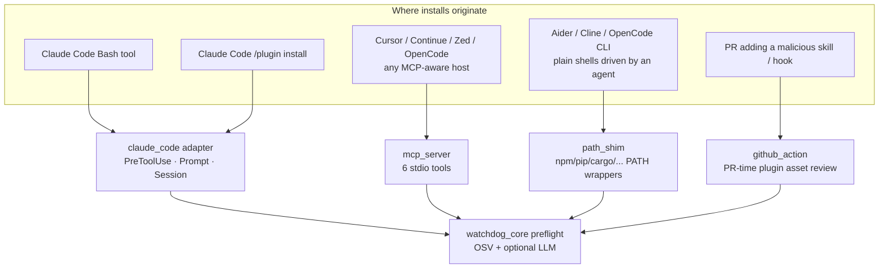
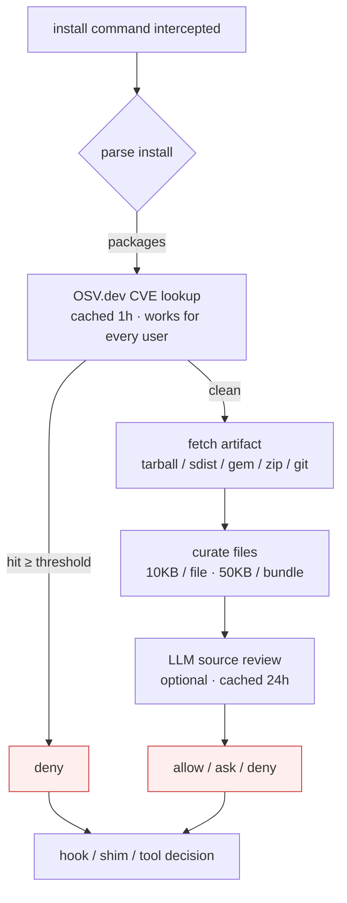
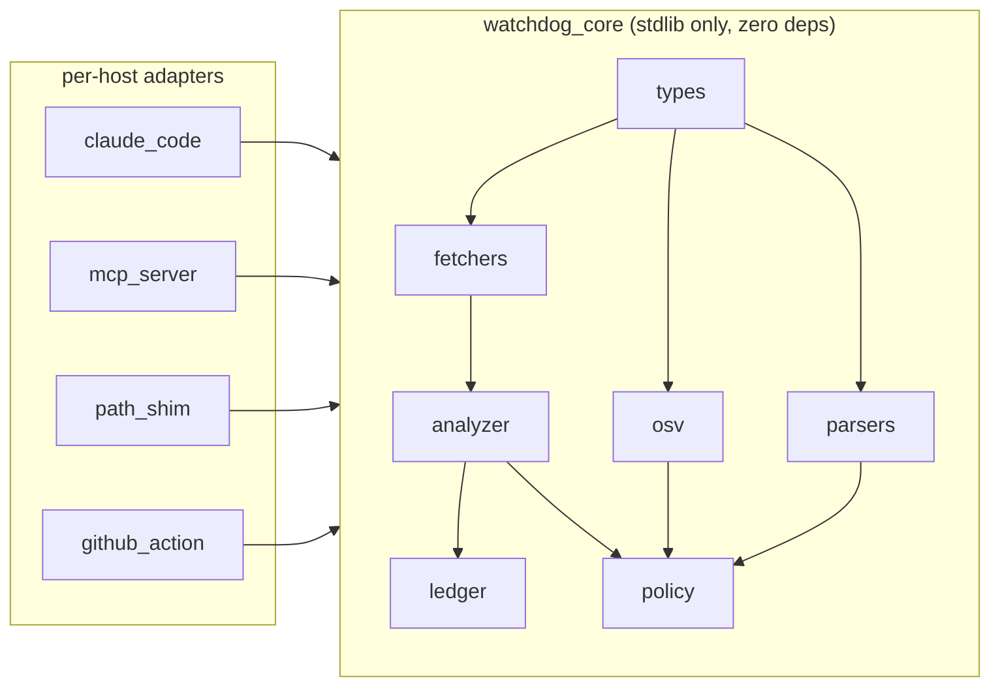

<div align="center">

# Watchdog

**Pre-install security review for AI-mediated package and plugin installs.**

Host-agnostic. Works with Claude Code, Cursor, Continue, Zed, OpenCode, Aider, Cline, plain shells driven by an agent — anywhere code gets installed on your behalf.

[](https://www.python.org/)
[](#license)
[](#testing)
[](#engine)

</div>

---

## Why it exists

AI coding agents now run package managers on your behalf. A single `npm install` issued by an agent — or a plugin that drops a hostile skill into `~/.claude/`, `~/.cursor/`, or wherever your host stores extensions — bypasses every tool you have for source repos. `npm audit`, Snyk, and Dependabot inspect manifest edits in version control. None of them inspect the **moment an agent reaches for the network**.

Watchdog plugs that gap. It intercepts installs at the **agent surface** — wherever an AI tool actually runs a package manager — and runs a two-stage check **before** the install lands:

1. **OSV.dev CVE lookup** — fast, deterministic, cached. Works regardless of which LLM you use.
2. **LLM source review** — pulls a curated subset of the artifact's files and asks the model to flag malicious patterns the CVE feed has not caught yet (typosquats, malicious `postinstall`, obfuscated payloads, credential-stealing skills).

Verdict: `allow`, `ask`, or `deny`. Worst across packages wins.

> **Scope discipline.** Watchdog targets the agent surface only. If your tool catches manifest edits in PRs, Watchdog is not your replacement — it covers the surface those tools were never designed for.

---

## Four surfaces, one engine



| Adapter         | Host                                                              | When to use                                                                            |
|-----------------|-------------------------------------------------------------------|----------------------------------------------------------------------------------------|
| `path_shim`     | **Anything that shells out** to a package manager                 | Universal catch-all. OpenCode, Aider, Cline, Cursor terminal, plain shell.             |
| `mcp_server`    | Any MCP-aware host (Cursor, Continue, Zed, custom agents)         | Native integration without writing host glue. Same cache as the other adapters.        |
| `claude_code`   | Claude Code only                                                  | Tightest integration: PreToolUse hook blocks the install **inside** the agent.         |
| `github_action` | GitHub PRs                                                        | Repos that ship Claude Code plugins/skills publicly.                                   |

All four adapters share `~/.cache/watchdog/`, so a plugin vetted by one is recognized by the rest.

---

## Not using Claude Code?

Most of Watchdog works for you out of the box.

### OpenCode, Aider, Cline, Cursor (terminal), plain agent-driven shell

Use the **PATH shim**. It wraps every package-manager binary and intercepts installs **before they execute**, no matter which agent or shell launched the command.

```bash
pip install watchdog-scanner
watchdog-shim install
# follow the printed instruction to prepend ~/.watchdog/bin to PATH
```

Now every `npm install`, `pip install`, `cargo add`, `gem install`, `composer require` — from any source — passes through Watchdog first. Non-install invocations (`npm test`, `pip --version`) pass through untouched.

### Cursor, Continue, Zed, any MCP-aware host

Use the **MCP server**. Configure once, your agent gets `watchdog_preflight_install`, `watchdog_scan_package`, `watchdog_audit_plugin`, and three more tools as native callable functions.

```bash
pip install "watchdog-scanner[mcp]"
```

```json
{
  "mcpServers": {
    "watchdog": { "command": "watchdog-mcp" }
  }
}
```

### Repos that ship Claude plugins / skills publicly

Use the **GitHub Action**. PR-time review of `.claude-plugin/`, `skills/`, `commands/`, `hooks/` — surfaces verdicts as workflow annotations and can fail the build.

```yaml
on:
  pull_request:
    paths:
      - '**/.claude-plugin/**'
      - '**/skills/**'
      - '**/commands/**.md'
      - '**/hooks/**'
jobs:
  watchdog:
    runs-on: ubuntu-latest
    steps:
      - uses: actions/checkout@v4
        with: { fetch-depth: 0 }
      - uses: Maxlemore97/Watchdog/adapters/github_action@v0.4.0
        with: { fail-on: deny }
```

---

## How the preflight works



Every adapter collapses to the same `preflight_packages()` call. One source of truth for the verdict math.

### LLM providers

Watchdog uses whichever local LLM CLI you already have. No new keys to manage, no extra service to run.

| Provider  | CLI binary | Default model               | Notes                                                |
|-----------|------------|-----------------------------|------------------------------------------------------|
| `claude`  | `claude`   | `claude-haiku-4-5-20251001` | Anthropic Claude Code CLI. Best verdict quality.     |
| `gemini`  | `gemini`   | `gemini-2.5-flash`          | Google Gemini CLI.                                   |
| `openai`  | `openai`   | `gpt-4.1-mini`              | OpenAI CLI (chat completions form).                  |
| `ollama`  | `ollama`   | `llama3.1`                  | Local-only. Private. Weaker verdicts on subtle cases.|
| `generic` | _custom_   | _your choice_               | Any CLI. Set `WATCHDOG_LLM_CMD="mymodel --args"`.    |

**Selection precedence:**

1. `WATCHDOG_LLM_PROVIDER` env var if set (e.g. `ollama`, `claude`).
2. **Auto-detect** on PATH in order: `claude → gemini → openai → ollama`. First one found wins.
3. If nothing is available, the analyzer falls back to `WATCHDOG_OFFLINE_DECISION` (default `ask`). OSV still runs.

**Notes:**

- **OSV-only mode** (`WATCHDOG_MODE=osv`) works for everyone — no LLM required. Full CVE coverage.
- Verdicts are **cached by `(provider, model, ecosystem, name, version)` sha256**, 24h TTL. Switching providers/models invalidates the cache so a weaker model cannot whitewash a stale verdict from a stronger one.
- Hosted models (`claude`/`gemini`/`openai`) hit your own API account. Ollama is fully local. Pick what matches your privacy + quality + cost tradeoff.

---

## Architecture



| Layer            | Lines  | Dependencies                              |
|------------------|--------|-------------------------------------------|
| `watchdog_core`  | ~2 100 | Python stdlib only                        |
| Adapters         | ~1 100 | `watchdog_core` (MCP adapter: `mcp>=1.0`) |
| Tests            | ~2 200 | `pytest` or stdlib `unittest`             |

---

## Quick start

Pick the surface that matches your setup.

### Claude Code

```text
/plugin marketplace add https://github.com/Maxlemore97/Watchdog
/plugin install watchdog
```

Installs `PreToolUse`, `UserPromptSubmit`, and `SessionStart` hooks plus the `/watchdog-scan` slash command.

### Any other agent / host

```bash
pip install watchdog-scanner           # engine + path_shim + github_action
pip install "watchdog-scanner[mcp]"    # adds MCP server
watchdog-shim install                  # PATH wrappers for npm/pip/cargo/...
```

### Requirements

- Python **3.10+**
- **One LLM CLI** on `PATH` for source review: `claude`, `gemini`, `openai`, or `ollama`. Watchdog auto-detects in that order. Without any of them, Watchdog runs OSV-only (still catches every disclosed CVE).
- `git` if you want plugin git URL audits.

---

## Ecosystems

| Ecosystem      | Detected commands                              | Files extracted for review                                  | Risk signal                                  |
|----------------|------------------------------------------------|-------------------------------------------------------------|----------------------------------------------|
| **npm**        | `npm/pnpm/yarn install\|i\|add`                | `package.json`, `index.{js,mjs,cjs}`, `README*`             | install/postinstall scripts                  |
| **PyPI**       | `pip/pip3/uv/poetry install\|add`              | `setup.py`, `setup.cfg`, `pyproject.toml`, `__init__.py`    | sdist required (wheel-only → metadata-only)  |
| **crates.io**  | `cargo add\|install`                           | `Cargo.toml`, `build.rs`, `src/lib.rs`, `src/main.rs`       | `has_build_script` flag                      |
| **RubyGems**   | `gem install`                                  | `<name>.gemspec`, `lib/<name>.rb`, `ext/**/extconf.rb`      | `has_native_extension`                       |
| **Packagist**  | `composer require`                             | `composer.json`, `README*`                                  | `has_install_scripts`                        |
| **Plugin git** | `/plugin install`, `/plugin marketplace add`   | `plugin.json`, `hooks/**`, `commands/**`, `skills/**`       | `allowed-tools` + body audit                 |

---

## Security model

Watchdog assumes the registry, the package, and the LLM are **all** potentially hostile. Defenses are layered.

```mermaid
flowchart LR
    A[Untrusted artifact] --> B[Size cap<br/>5MB download · 10KB/file · 50KB bundle]
    B --> C[Archive hardening<br/>tarfile.data_filter · no symlinks]
    C --> D[Deterministic prefilter<br/>AKIA / ghp_ / PEM / curl|sh / env|curl]
    D -->|hit| Z[deny — never reaches LLM]
    D -->|clean| E[XML wrap + escape<br/>&lt;UNTRUSTED kind=… path=…&gt;]
    E --> F[LLM subprocess<br/>--max-turns 1 · --allowed-tools '' · WATCHDOG_DISABLE=1]
    F --> G[Strict JSON verdict<br/>3-tier extraction fallback]
    G --> H[Cache: model+eco+name+version sha256]
```

- **Prompt injection defense.** Untrusted content sits inside `<UNTRUSTED kind="..." path="...">` tags. Path attributes are `html.escape`'d. Embedded `</UNTRUSTED` closers are neutralized in the body. System prompt explicitly tells the model to treat tagged content as data, never instructions.
- **Deterministic prefilter.** A regex pass for high-signal indicators (AWS key shape, GitHub PAT, PEM blocks, `printenv | curl`, `curl … | sh`) short-circuits **before** the LLM. A jailbroken model cannot whitewash a hit.
- **Recursion guard.** The analyzer sets `WATCHDOG_DISABLE=1` on the LLM subprocess, so any nested agent session's hooks short-circuit instead of re-invoking the analyzer.
- **Sandboxed LLM call.** `--max-turns 1`, `--allowed-tools ""`, prompt via stdin (not argv), 60s timeout.
- **Hardened git clone.** `GIT_TERMINAL_PROMPT=0`, `GIT_ASKPASS=/bin/true`, `BatchMode=yes`, `--depth=1 --filter=blob:none`, 20s timeout, `--` URL separator.
- **Fail closed.** OSV unreachable or LLM CLI missing → `ask` by default (configurable). No silent allows.

---

## Verdicts

| Verdict | Meaning                                                                              |
|---------|--------------------------------------------------------------------------------------|
| `allow` | No OSV CVE at/above threshold, no analyzer red flags.                                |
| `ask`   | Suspicious but inconclusive, or analyzer offline. User decides.                      |
| `deny`  | Concrete malicious indicator (OSV hit, prefilter match, or analyzer flagged evidence).|

Aggregation: `allow < ask < deny`, worst wins across packages. OSV `deny` short-circuits the LLM in `mode=both`.

---

## Examples

**Blocked install of a known-vulnerable lodash** (works for every host, OSV-only or otherwise):

```text
$ npm install lodash@4.17.20
watchdog: deny — npm:lodash@4.17.20 → GHSA-35jh-r3h4-6jhm[high]
```

**Allowed after clean LLM review:**

```text
$ npm install lodash@4.17.21
watchdog: allow — [llm] npm:lodash@4.17.21: legitimate package by original author,
  no install scripts, no suspicious code or network calls.
```

**Manual ad-hoc audit (Claude Code):**

```text
/watchdog-scan https://github.com/some/claude-plugin
```

**From a non-Claude agent via MCP (Cursor, Continue, Zed, custom):**

```text
> tool: watchdog_preflight_install
> args: command="npm install lodash@4.17.20"
< { "verdict": "deny", "reason": "GHSA-35jh-r3h4-6jhm", "packages": [...] }
```

**Path shim, any agent that shells out:**

```text
$ npm install evil-typosquat
watchdog: blocked install. [llm] npm:evil-typosquat: 1-char edit distance from
  popular package; postinstall hook fetches a remote shell script. Proceed? [y/N]:
```

---

## Configuration

All env-var driven. None required.

| Variable                       | Default              | Purpose                                                          |
|--------------------------------|----------------------|------------------------------------------------------------------|
| `WATCHDOG_MODE`                | `both`               | `osv` / `claude` / `both`                                        |
| `WATCHDOG_MIN_SEVERITY`        | `low`                | OSV threshold (`none`/`low`/`medium`/`high`/`critical`)          |
| `WATCHDOG_OFFLINE_DECISION`    | `ask`                | Verdict when OSV/LLM unreachable                                 |
| `WATCHDOG_RESOLVE_LATEST`      | `1`                  | Resolve latest version when unspecified                          |
| `WATCHDOG_CACHE_DIR`           | `~/.cache/watchdog`  | Cache root                                                       |
| `WATCHDOG_CACHE_TTL`           | `3600`               | OSV cache TTL (s)                                                |
| `WATCHDOG_LLM_PROVIDER`        | `auto`               | `auto` / `claude` / `gemini` / `openai` / `ollama` / `generic`   |
| `WATCHDOG_LLM_BIN`             | _provider default_   | Override CLI binary for the selected provider                    |
| `WATCHDOG_LLM_MODEL`           | _provider default_   | Override model name; falls back to provider's default            |
| `WATCHDOG_LLM_TIMEOUT`         | `60`                 | LLM CLI invocation timeout (s)                                   |
| `WATCHDOG_LLM_CACHE_TTL`       | `86400`              | LLM verdict cache TTL (s)                                        |
| `WATCHDOG_LLM_CMD`             | _unset_              | Full command for `generic` provider (shlex-split, stdin-fed)     |
| `WATCHDOG_LLM_APPEND_SYSTEM`   | `1`                  | Skip system-prompt injection if `0`                              |
| `WATCHDOG_PYTHON`              | `python3`            | Interpreter for hook shim                                        |
| `WATCHDOG_MASCOT`              | `1`                  | ASCII police-dog on stderr; `0`/`false`/`no`/`off` to silence    |
| `WATCHDOG_PLUGIN_DIRS`         | `~/.claude/plugins`  | `os.pathsep`-separated dirs for SessionStart scan                |
| `WATCHDOG_SESSION_MAX_SCANS`   | `10`                 | Max plugins analyzed per SessionStart event                      |
| `WATCHDOG_HOOK_BUDGET_SECS`    | `30`                 | Wall-clock cap for the Claude Code PreToolUse hook               |

---

## Engine

If you're building your own agent or tooling, use `watchdog_core` directly. Stdlib only.

```python
from watchdog_core import (
    collect_packages,             # parse a shell install command
    query_osv, resolve_version,   # OSV.dev lookups
    analyze_package,              # LLM source review
    analyze_local_plugin,         # local plugin directory audit
    discover_plugins,             # scan known plugin dirs
    load_ledger, save_ledger,     # persistent vetted-plugins ledger
    worst_verdict,                # verdict aggregation
)

pkgs, notes = collect_packages("npm install lodash@4.17.20")
for pkg in pkgs:
    print(query_osv(pkg))
```

Verdict aggregation (the same function every adapter calls):

```python
from adapters._shared.preflight import preflight_packages

result = preflight_packages(pkgs, notes, mode="both", budget_secs=30)
# {"verdict": "deny", "reason": "...", "packages": [...], "findings": [...]}
```

---

## Repository layout

```
Watchdog/
├── pyproject.toml
├── .claude-plugin/plugin.json          ── Claude Code plugin manifest
├── watchdog_core/                      ── engine (zero deps, stdlib only)
│   ├── types.py · parsers.py · osv.py · fetchers.py
│   ├── analyzer.py · ledger.py · policy.py · mascot.py
├── adapters/
│   ├── _shared/preflight.py            ── single verdict aggregator
│   ├── claude_code/                    ── PreToolUse + UserPromptSubmit + SessionStart + /watchdog-scan
│   ├── mcp_server/                     ── FastMCP tools
│   ├── path_shim/                      ── npm/pip/cargo/... PATH wrappers
│   └── github_action/                  ── PR-time plugin asset review
└── tests/                              ── 250 tests, mocked, <2s wall clock
```

---

## Testing

```bash
python3 -m unittest discover -s tests
```

**250 tests, ~1.9s, zero network.** Every external dependency (OSV, npm/PyPI/crates/RubyGems/Packagist registries, `git clone`, LLM CLI, MCP SDK) is mocked or skipped when absent. The suite covers:

- Install-command parsing for every supported ecosystem, including chained `&&`/`;`/`||`, `bash -c "..."` subshells, malformed shells (must produce `ask`, not silent allow), and quoted-operator preservation.
- Prompt injection mitigations: `</UNTRUSTED` neutralization, path attribute escape, hostile prefilter patterns.
- Verdict extraction across fenced JSON, JSON-in-prose, envelope formats, and stray-brace fallbacks.
- Archive-fetch curation per ecosystem (npm, PyPI sdist, crates.io, RubyGems, Packagist).
- Plugin content-hash determinism and SessionStart ledger flow.
- Adapter contracts (hook JSON in/out, MCP tool wrappers, shim install/uninstall, GitHub Action diff handling, shared preflight aggregation).

---

## Limitations

- The `UserPromptSubmit` interceptor matches `/plugin install` and `/plugin marketplace add`. If a Claude Code UI flow installs plugins without surfacing one of those prompts, that path is uncovered until the interceptor learns it. Fall back to `/watchdog-scan` or `path_shim`.
- Verdict quality scales with model strength. Hosted code-tuned models (`claude`, `gemini`, `openai`) catch subtle patterns local Ollama models miss. The deterministic prefilter (`AKIA*`, PEM blocks, `curl|sh`, etc.) and OSV layer fire regardless of provider, so basic coverage is uniform.
- Wheel-only PyPI packages have no sdist to extract; the analyzer falls back to metadata-only reasoning.
- LLM verdicts are non-deterministic. Cache TTL is 24h; clear `~/.cache/watchdog` to force re-analysis.
- OSV.dev advisories are only as good as the underlying data. Unknown-severity vulns are ranked `high` by default to fail safe.
- `path_shim` is POSIX-only in v1. Windows is out of scope.

---

## Roadmap

- Windows support for `path_shim`.
- Optional telemetry: per-call latency + token usage to `WATCHDOG_LOG` so production users can track LLM cost.
- Golden-set LLM verdict eval harness comparing providers (nightly, against pinned models).
- More built-in providers: Aider, Codex, direct HTTP API mode (skip CLI entirely).

---

## License

MIT.

## Author

[Maxlemore97](https://github.com/Maxlemore97)
