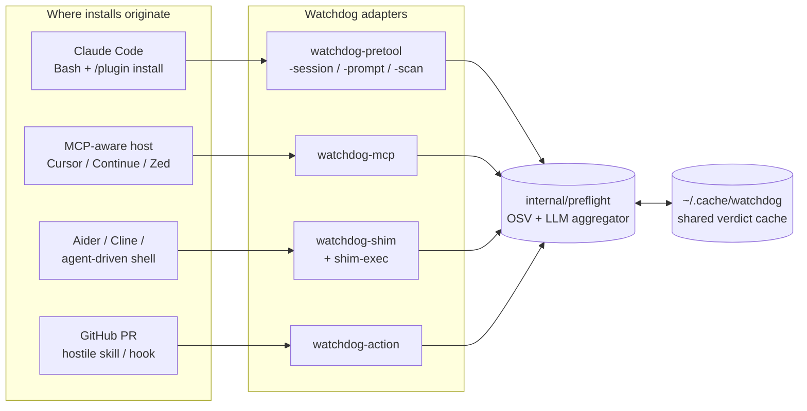

<div align="center">

# Watchdog

**Pre-install security review for AI-mediated package and plugin installs.**

Single static binary. No Python. Linux, macOS, Windows.

Host-agnostic. Catches installs from Claude Code, Cursor, Continue, Zed, OpenCode, Aider, Cline, plain shells driven by an agent — anywhere code gets installed on your behalf.

[](https://go.dev/)
[](LICENSE)
[](#testing)
[](#engine)

</div>

---

## Why it exists

AI coding agents now run package managers on your behalf. A single `npm install` issued by an agent — or a plugin that drops a hostile skill into `~/.claude/`, `~/.cursor/`, or wherever your host stores extensions — bypasses every tool you have for source repos. `npm audit`, Snyk, and Dependabot inspect manifest edits in version control. None of them inspect **the moment an agent reaches for the network**.

Watchdog plugs that gap. It intercepts installs at the **agent surface** — wherever an AI tool actually runs a package manager — and runs a two-stage check **before** the install lands:

1. **OSV.dev CVE lookup** — fast, deterministic, cached. Works regardless of which LLM you use.
2. **LLM source review** — pulls a curated subset of the artifact's files and asks the model to flag malicious patterns the CVE feed has not caught yet (typosquats, malicious `postinstall`, obfuscated payloads, credential-stealing skills).

Verdict: `allow`, `ask`, or `deny`. Worst across packages wins. Fail-closed defaults: missing CLI / offline network → `ask`, never silent allow.

> **Scope discipline.** Watchdog targets the agent surface only. If your tool catches manifest edits in PRs, Watchdog is not your replacement — it covers the surface those tools were never designed for.

---

## Quick start

Three commands, end to end:

```bash
# 1. Install the binaries.
curl -fsSL https://raw.githubusercontent.com/Maxlemore97/Watchdog/main/install.sh | sh

# 2. Add the install dir to PATH (if the installer warned about it),
#    then install the package-manager shims.
export PATH="$HOME/.local/bin:$PATH"
watchdog-shim install

# 3. Put the shim dir at the FRONT of your PATH (printed by step 2),
#    open a new shell, then verify.
export PATH="$HOME/.watchdog/bin:$PATH"
watchdog-shim doctor
```

Expected `doctor` output when set up correctly:

```
watchdog-shim doctor:
  ok  shim dir is first on PATH
  ok  watchdog-shim-exec found on PATH
  ok  at least one LLM provider CLI on PATH
  ok  cache dir writable (/home/you/.cache/watchdog)
```

`warn no LLM provider CLI` is fine — Watchdog falls back to OSV-only checks. Install one of `claude`, `gemini`, `openai`, or `ollama` to enable LLM source review (see [LLM providers](#llm-providers)).

---

## Install

Pick one of:

### A. Install script (Linux / macOS)

```bash
curl -fsSL https://raw.githubusercontent.com/Maxlemore97/Watchdog/main/install.sh | sh
```

Downloads the latest release for your OS+arch, verifies its SHA-256 against the published `checksums.txt`, and drops eight binaries into `~/.local/bin` (override via `WATCHDOG_INSTALL_DIR`). Pin a version with `WATCHDOG_VERSION=v0.4.0 sh install.sh`.

### B. Install script (Windows PowerShell)

```powershell
iwr -useb https://raw.githubusercontent.com/Maxlemore97/Watchdog/main/install.ps1 | iex
```

Drops binaries into `%USERPROFILE%\.watchdog\bin`. The script prints a one-liner that adds the dir to your user PATH; copy-paste it and restart your shell.

### C. `go install`

If you have Go 1.25+:

```bash
go install github.com/Maxlemore97/watchdog/cmd/...@latest
```

Builds and installs all eight binaries under `$(go env GOPATH)/bin`. Ensure that dir is on your PATH.

### D. Release tarball (air-gapped / locked-down environments)

Grab the tarball or zip for your platform from [Releases](https://github.com/Maxlemore97/Watchdog/releases), verify `checksums.txt`, extract, and copy the binaries anywhere on your PATH.

---

## Set up the package-manager shims

The shims are PATH-prepend wrappers that intercept every `npm`, `pip`, `cargo`, `gem`, `composer`, `pnpm`, `yarn`, `bun`, `pip3`, `uv`, and `poetry` invocation. Without them, Watchdog only fires inside Claude Code or MCP-aware hosts.

```bash
watchdog-shim install
```

Writes eleven wrapper scripts into `~/.watchdog/bin/` (Linux/macOS) or `%USERPROFILE%\.watchdog\bin` (Windows). The command prints the exact PATH line to add. **The shim dir must be FIRST on your PATH** — otherwise installs resolve to the real binary directly and bypass scanning.

Linux / macOS, bash or zsh:

```bash
echo 'export PATH="$HOME/.watchdog/bin:$PATH"' >> ~/.bashrc   # or ~/.zshrc
exec $SHELL -l
```

Windows PowerShell (persistent, user-scoped):

```powershell
[Environment]::SetEnvironmentVariable(
  'Path', "$env:USERPROFILE\.watchdog\bin;" + [Environment]::GetEnvironmentVariable('Path','User'), 'User')
```

Verify:

```bash
watchdog-shim doctor
watchdog-shim status   # per-tool install state
```

To remove the shims later: `watchdog-shim uninstall` (only deletes scripts carrying the `Watchdog shim` marker — your own binaries are safe).

---

## LLM providers

Optional but recommended. Watchdog shells out to whichever local LLM CLI you have installed. Auto-detect order: `claude → gemini → openai → ollama`. Pin one with `WATCHDOG_LLM_PROVIDER`.

| Provider | CLI binary | Default model                | Install hint                                                   |
|----------|------------|------------------------------|----------------------------------------------------------------|
| Claude   | `claude`   | `claude-haiku-4-5-20251001`  | [Claude Code](https://claude.com/claude-code)                  |
| Gemini   | `gemini`   | `gemini-2.5-flash`           | `npm install -g @google/gemini-cli`                            |
| OpenAI   | `openai`   | `gpt-4.1-mini`               | `pip install openai`                                           |
| Ollama   | `ollama`   | `llama3.1`                   | [ollama.com](https://ollama.com)                               |
| Generic  | `WATCHDOG_LLM_CMD` | user-specified     | Any CLI that reads a prompt on stdin and writes JSON on stdout |

Verdict cache keys include `(provider, model)`, so switching CLIs invalidates prior verdicts — a weaker model cannot whitewash a verdict cached by a stronger one.

The analyzer only accepts a verdict that is either the model's entire trimmed output as one JSON object, or wrapped in a fenced ```` ```json ```` block. Prose-embedded JSON is ignored — a hostile artifact echoed back by the model cannot smuggle a forged verdict object. Unparseable output falls through to `ask`.

No CLI installed? Watchdog still runs OSV.dev CVE checks; only the LLM source review is skipped.

---

## Four surfaces, one engine



| Adapter         | Host                                                              | When to use                                                                            |
|-----------------|-------------------------------------------------------------------|----------------------------------------------------------------------------------------|
| `watchdog-shim` | **Anything that shells out** to a package manager                 | Universal catch-all. OpenCode, Aider, Cline, Cursor terminal, plain shell.             |
| `watchdog-mcp`  | Any MCP-aware host (Cursor, Continue, Zed, custom agents)         | Native integration without writing host glue. Same cache as the other adapters.        |
| `watchdog-pretool`<br/>`-session` / `-prompt` / `-scan` | Claude Code                                  | Tightest integration: PreToolUse hook blocks the install **inside** the agent.         |
| `watchdog-action` | GitHub PRs                                                      | Repos that ship Claude Code plugins/skills publicly.                                   |

All four adapters share `~/.cache/watchdog/`, so a plugin vetted by one is recognised by the rest.

---

## How a verdict is decided

Every adapter funnels into the same pipeline. OSV runs first because it's fast, deterministic, and cached. A deny there short-circuits the LLM stage. A clean OSV result still goes through the deterministic prefilter (PEM keys, AWS/GitHub/OpenAI/Slack token shapes, `curl … | sh`, env-piped-to-network); only clean prefilter output reaches the LLM source review.


Fail-closed defaults at every step: OSV unreachable → `ask` (or `deny` for the shim, which has no UI to ask through); analyzer panic recovered into `ask`; budget exceeded → `ask`. No silent allow.

---

## Claude Code plugin

This repository ships a Claude Code plugin (`.claude-plugin/plugin.json` + hook scripts under `hooks/`) that registers three hooks: `PreToolUse` on Bash, `UserPromptSubmit`, and `SessionStart`.

In a Claude Code session:

```
/plugin marketplace add Maxlemore97/Watchdog
/plugin install watchdog@watchdog-marketplace
```

The first line registers this repo as a plugin marketplace; the second installs the `watchdog` plugin from it. The hook scripts (`hooks/pretool.sh` etc.) shell out to the `watchdog-pretool` / `watchdog-session` / `watchdog-prompt` binaries on your PATH — **install the binaries first** (see [Install](#install)). If the binaries are missing, the hook scripts exit silently rather than overriding other plugins' decisions.

Confirm the plugin is wired up: in Claude Code run `/plugin` and look for `watchdog` in the installed list. New Bash installs (`npm install …`) now trigger the PreToolUse check; a deny shows up in the Claude UI as a blocked tool call.

---

## MCP server

`watchdog-mcp` is a stdio MCP server. Six tools:

| Tool                            | What it does                                            |
|---------------------------------|---------------------------------------------------------|
| `watchdog_preflight_install`    | Parse + OSV + (optional) LLM on a full install command  |
| `watchdog_scan_package`         | LLM source review of one published package              |
| `watchdog_audit_plugin`         | Audit a plugin git URL or `name@version`                |
| `watchdog_audit_plugin_local`   | Audit an already-installed plugin directory             |
| `watchdog_list_vetted_plugins`  | Read the persistent vetted-plugins ledger               |
| `watchdog_osv_query`            | Raw OSV.dev query for diagnostics                       |

Configure in your MCP client (Cursor, Continue, Claude Desktop, …):

```json
{
  "mcpServers": {
    "watchdog": { "command": "watchdog-mcp" }
  }
}
```

`watchdog-mcp` must be on the host process's PATH. Absolute path also works: `"command": "/home/you/.local/bin/watchdog-mcp"`.

---

## GitHub Action

For repos that publish Claude Code plugins or skills, the Action runs `analyze_local_plugin` on every modified plugin root on PR. Annotations land as file-level comments; the job exits non-zero when any plugin is denied (configurable via `fail-on`).

```yaml
name: Watchdog
on: [pull_request]
permissions:
  contents: read
  pull-requests: write
jobs:
  watchdog:
    runs-on: ubuntu-latest
    steps:
      - uses: actions/checkout@v4
        with: { fetch-depth: 0 }
      - uses: Maxlemore97/Watchdog@v1
        with:
          fail-on: deny     # deny | ask | never
```

Inputs: `fail-on` (default `deny`), `model` (override default LLM), `base-ref` (auto-detected), `version` (pin a Watchdog release).

---

## Configuration

All knobs are env vars. Sensible defaults; nothing required.

| Env var                         | Default            | What it does                                                  |
|---------------------------------|--------------------|---------------------------------------------------------------|
| `WATCHDOG_MODE`                 | `both`             | `osv` / `claude` / `both`                                     |
| `WATCHDOG_MIN_SEVERITY`         | `low`              | OSV severity floor (`none`/`low`/`medium`/`high`/`critical`)  |
| `WATCHDOG_OFFLINE_DECISION`     | `ask` (hooks) / `deny` (shim) | What to emit when OSV unreachable / LLM CLI missing |
| `WATCHDOG_MAX_PACKAGES`         | `50`               | Above this, return `ask` without scanning                     |
| `WATCHDOG_LLM_PROVIDER`         | `auto`             | `claude` / `gemini` / `openai` / `ollama` / `generic`         |
| `WATCHDOG_LLM_MODEL`            | per-provider       | Override model name                                           |
| `WATCHDOG_LLM_TIMEOUT`          | `60`               | Per-invocation timeout in seconds                             |
| `WATCHDOG_LLM_CMD`              | —                  | When provider=`generic`, the CLI to spawn                     |
| `WATCHDOG_CACHE_DIR`            | `~/.cache/watchdog`| Where verdicts + ledger live                                  |
| `WATCHDOG_CACHE_TTL`            | `3600`             | OSV cache TTL (seconds)                                       |
| `WATCHDOG_LLM_CACHE_TTL`        | `86400`            | LLM-verdict cache TTL (seconds)                               |
| `WATCHDOG_HOOK_BUDGET_SECS`     | `30`               | Wall-clock cap per hook invocation                            |
| `WATCHDOG_SESSION_MAX_SCANS`    | `10`               | Max plugins re-analyzed per SessionStart                      |
| `WATCHDOG_ACTION_FAIL_ON`       | `deny`             | `deny` / `ask` / `never` for GitHub Action exit code          |
| `WATCHDOG_OSV_ENDPOINT`         | OSV.dev            | Override (http/https only — `file://` rejected)               |
| `WATCHDOG_LOG`                  | —                  | If set, JSON-line event log path                              |
| `WATCHDOG_DISABLE`              | —                  | Set to `1` in nested LLM child env to break hook recursion    |

---

## Troubleshooting

**`watchdog-shim doctor` says shim dir not first on PATH.**
You appended instead of prepended. Re-export with the shim dir on the **left** of `$PATH`, restart the shell.

**`watchdog-shim-exec: real binary "npm" not found on PATH`.**
The shim dir is on PATH but no other entry contains `npm`. Install Node/npm via your usual route; the shim will pick it up next call.

**Claude Code hook fires but verdict says "watchdog: plugin install detected but analyzer unavailable".**
No LLM CLI on PATH. Install one (see [LLM providers](#llm-providers)) or set `WATCHDOG_MODE=osv` to skip the LLM stage.

**`go install` reports `package github.com/.../cmd/...: cannot find package`.**
Run `go version`. Need 1.25+. Older Go cannot resolve the wildcard form; install binaries individually (`go install github.com/Maxlemore97/watchdog/cmd/watchdog-pretool@latest`) or use the install script.

**Hook says "scan budget exceeded".**
Raise `WATCHDOG_HOOK_BUDGET_SECS` (default 30) or `WATCHDOG_MAX_PACKAGES` (default 50). Large monorepo `npm install` from lockfile can produce >50 packages.

**Want to bypass once.**
`WATCHDOG_DISABLE=1 npm install something`. Watchdog short-circuits to a pass-through.

---

## Threat model

See [SECURITY.md](SECURITY.md) for the full threat model and disclosure address.

Highlights:
- **In scope:** prompt injection from fetched artifacts, malicious install commands, supply-chain payloads in published packages, hostile plugin repos, recursive LLM invocation, OSV / registry network failure, DoS via install-command fan-out.
- **Out of scope:** local filesystem integrity (verdict cache poisoning), compromised LLM provider CLIs, SSRF via plugin git URLs.

Report vulnerabilities via GitHub Security Advisories on this repo.

---

## Engine

Core (parser, OSV, fetchers, analyzer, ledger, preflight) is **stdlib only**. The MCP server depends on [`github.com/mark3labs/mcp-go`](https://github.com/mark3labs/mcp-go); pure Watchdog code stays vendorable.

Source layout:

```
cmd/                  thin CLI entry points (each <200 LOC)
  watchdog-pretool/   Claude Code PreToolUse hook
  watchdog-session/   Claude Code SessionStart hook
  watchdog-prompt/    Claude Code UserPromptSubmit hook
  watchdog-scan/      manual /watchdog-scan slash command
  watchdog-mcp/       MCP stdio server (uses mark3labs/mcp-go)
  watchdog-shim/      install/uninstall/status/doctor CLI
  watchdog-shim-exec/ per-call shim dispatcher
  watchdog-action/    GitHub Action entry
internal/
  types/      Package, ArtifactBundle structs
  paths/      cache_dir() resolution
  log/        opt-in JSON-line event log
  policy/     verdict ranking + worst-wins
  osv/        OSV.dev query, severity, version resolution
  parsers/    install command lexer + plugin prompt parser
  fetchers/   per-ecosystem artifact fetch + tar safety
  analyzer/   LLM prompt + prefilter + verdict extraction
  providers/  multi-LLM CLI registry
  ledger/     persistent plugin vetting ledger
  preflight/  shared OSV+LLM aggregator
  shim/       wrapper templates, FindRealBinary
  ghaction/   workflow command emitter, path classifiers
  urlenc/     shared URL-path escaper
  config/     env validation + Disabled() helper
hooks/        Claude Code hook shell scripts (POSIX)
```

---

## Building from source

Requires Go 1.25+ (mcp-go runtime dep floor).

```bash
git clone https://github.com/Maxlemore97/Watchdog
cd Watchdog
go build ./...
go test -race ./...
```

`asdf` users: `.tool-versions` pins Go 1.26.3.

---

## Testing

Race-clean. No network. Adversarial-archive corpus + prompt-injection cases for the analyzer.

```bash
go test -race ./...
```

---

## License

[MIT](LICENSE) © Maxlemore97
