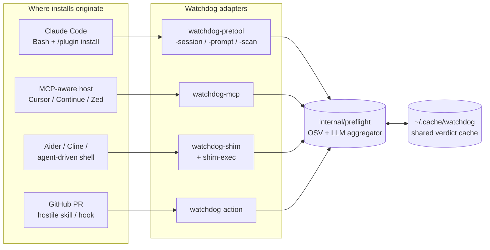
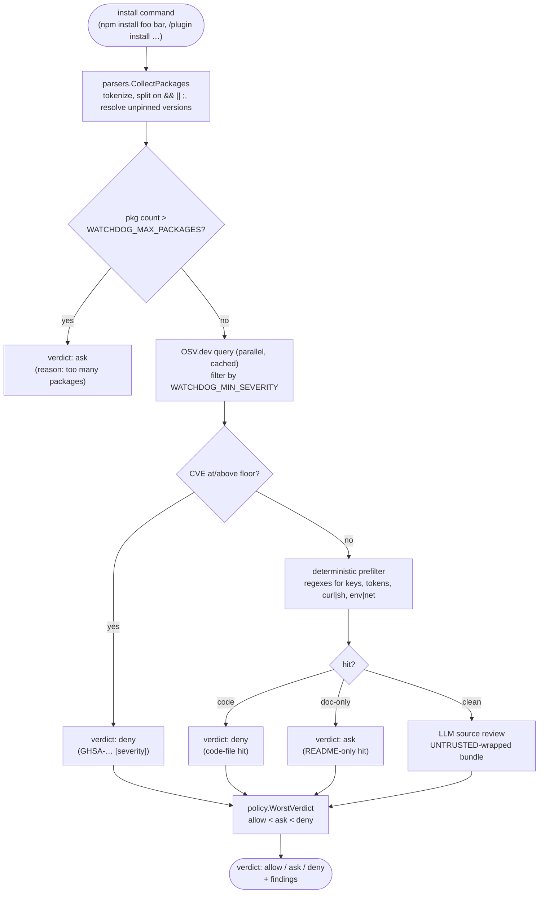

# Watchdog

Checks package installs before they actually run. When an AI agent decides to `npm install` something for you (or `pip`, `cargo`, `gem`, `bun`, etc.), Watchdog intercepts the command, asks OSV.dev about known CVEs, and optionally feeds the artifact to a local LLM for a source review. You get `allow`, `ask`, or `deny` back before anything lands on disk.

Static Go binary. No Python runtime. Linux, macOS, Windows.

It works with Claude Code, Cursor, Continue, Zed, OpenCode, Aider, Cline, and plain shells that an agent happens to be driving.

[](https://go.dev/)
[](LICENSE)
[](#testing)
[](#engine)

---

## What it's for

`npm audit`, Snyk, and Dependabot all inspect manifest edits in your repository. They don't see the install command an agent types at a prompt. They also don't see a plugin that drops a hostile skill into `~/.claude/` or wherever your host stores extensions.

Watchdog sits in front of that. The check runs in two stages:

1. OSV.dev lookup. Cached, parallel, no LLM involved.
2. If OSV is clean, an LLM source review on a curated subset of the artifact's files. The model is asked to look for typosquats, malicious `postinstall` scripts, obfuscated payloads, credential-stealing skills, and so on.

Worst verdict across the packages in a command wins. If OSV is unreachable, the LLM CLI isn't installed, or the analyzer times out, the default is `ask`. There's no path where Watchdog silently allows something it couldn't check.

If you already have something covering manifest edits in PRs, this isn't a replacement for that. It covers the surface those tools weren't built for.

---

## Quick start

Three commands:

```bash
# 1. Install the binaries.
curl -fsSL https://raw.githubusercontent.com/Maxlemore97/Watchdog/main/install.sh | sh

# 2. If the installer warned about PATH, fix it. Then install the
#    package-manager shims.
export PATH="$HOME/.local/bin:$PATH"
watchdog-shim install

# 3. Put the shim dir at the FRONT of your PATH (the previous step
#    prints the exact line), open a new shell, then check.
export PATH="$HOME/.watchdog/bin:$PATH"
watchdog-shim doctor
```

Healthy `doctor` output:

```
watchdog-shim doctor:
  ok  shim dir is first on PATH
  ok  watchdog-shim-exec found on PATH
  ok  at least one LLM provider CLI on PATH
  ok  cache dir writable (/home/you/.cache/watchdog)
```

If `doctor` warns that no LLM provider CLI is on PATH, that's fine. Watchdog will still run OSV checks; the LLM review just gets skipped. Install `claude`, `gemini`, `openai`, or `ollama` if you want it back (see [LLM providers](#llm-providers)).

---

## Install

Pick whichever applies.

### A. Install script (Linux / macOS)

```bash
curl -fsSL https://raw.githubusercontent.com/Maxlemore97/Watchdog/main/install.sh | sh
```

Pulls the latest release for your OS+arch, verifies SHA-256 against the published `checksums.txt`, and drops eight binaries into `~/.local/bin`. Override the destination with `WATCHDOG_INSTALL_DIR`. Pin a version with `WATCHDOG_VERSION=v0.4.0 sh install.sh`.

### B. Install script (Windows PowerShell)

```powershell
iwr -useb https://raw.githubusercontent.com/Maxlemore97/Watchdog/main/install.ps1 | iex
```

Drops binaries into `%USERPROFILE%\.watchdog\bin`. The script prints a one-liner that puts that on your user PATH. Copy-paste it and restart your shell.

### C. `go install`

If you have Go 1.25+:

```bash
go install github.com/Maxlemore97/watchdog/cmd/...@latest
```

Installs all eight binaries under `$(go env GOPATH)/bin`. Make sure that's on your PATH.

### D. Release tarball

For air-gapped or locked-down machines. Grab the archive for your platform from [Releases](https://github.com/Maxlemore97/Watchdog/releases), check `checksums.txt`, extract, and copy the binaries somewhere on your PATH.

---

## Set up the package-manager shims

The shims are PATH-prepend wrappers for `npm`, `pip`, `pip3`, `pnpm`, `yarn`, `bun`, `uv`, `poetry`, `cargo`, `gem`, and `composer`. Without them, Watchdog only fires inside Claude Code or an MCP-aware host.

```bash
watchdog-shim install
```

Writes eleven wrapper scripts into `~/.watchdog/bin/` (or `%USERPROFILE%\.watchdog\bin` on Windows) and prints the PATH line you need to add. The shim dir has to be **first** on your PATH; otherwise the shell finds the real binary directly and the check never runs.

Linux / macOS, bash or zsh:

```bash
echo 'export PATH="$HOME/.watchdog/bin:$PATH"' >> ~/.bashrc   # or ~/.zshrc
exec $SHELL -l
```

Windows PowerShell (persistent, user-scoped):

```powershell
[Environment]::SetEnvironmentVariable(
  'Path', "$env:USERPROFILE\.watchdog\bin;" + [Environment]::GetEnvironmentVariable('Path','User'), 'User')
```

Verify:

```bash
watchdog-shim doctor
watchdog-shim status   # per-tool install state
```

To remove later: `watchdog-shim uninstall`. It only deletes scripts that carry the `Watchdog shim` marker, so your own binaries are untouched.

---

## LLM providers

Optional, recommended. Watchdog shells out to whichever local LLM CLI you have. Auto-detect order: `claude → gemini → openai → ollama`. Pin one with `WATCHDOG_LLM_PROVIDER`.

| Provider | CLI binary | Default model                | Install hint                                                   |
|----------|------------|------------------------------|----------------------------------------------------------------|
| Claude   | `claude`   | `claude-haiku-4-5-20251001`  | [Claude Code](https://claude.com/claude-code)                  |
| Gemini   | `gemini`   | `gemini-2.5-flash`           | `npm install -g @google/gemini-cli`                            |
| OpenAI   | `openai`   | `gpt-4.1-mini`               | `pip install openai`                                           |
| Ollama   | `ollama`   | `llama3.1`                   | [ollama.com](https://ollama.com)                               |
| Generic  | `WATCHDOG_LLM_CMD` | user-specified     | Any CLI that reads a prompt on stdin and writes JSON on stdout |

Verdict cache keys include `(provider, model)`. Switching CLIs invalidates prior verdicts, so a weaker model can't whitewash something a stronger one cached.

A verdict is only accepted if the model's entire trimmed output is one JSON object, or wraps that JSON in a ```` ```json ```` fence. Prose-embedded JSON is ignored; a hostile artifact echoed back can't smuggle a forged verdict object. If parsing fails, the fallback is `ask`.

No CLI installed? OSV checks still run, just without the LLM stage.

---

## Four surfaces, one engine



| Adapter         | Host                                                              | When to use                                                                            |
|-----------------|-------------------------------------------------------------------|----------------------------------------------------------------------------------------|
| `watchdog-shim` | Anything that shells out to a package manager                     | The general catch-all. OpenCode, Aider, Cline, Cursor terminal, plain shell.           |
| `watchdog-mcp`  | Any MCP-aware host (Cursor, Continue, Zed, custom agents)         | Native integration without writing host glue. Shares the cache.                        |
| `watchdog-pretool`<br/>`-session` / `-prompt` / `-scan` | Claude Code                                  | Tightest integration. The PreToolUse hook blocks the install inside the agent.         |
| `watchdog-action` | GitHub PRs                                                      | Repos that publish Claude Code plugins or skills.                                      |

All four share `~/.cache/watchdog/`, so a plugin vetted by one adapter is recognized by the others.

---

## How a verdict is decided

Every adapter funnels into the same pipeline. OSV runs first because it's quick and cached; an OSV deny short-circuits the rest. A clean OSV result still goes through a deterministic prefilter (PEM keys, AWS / GitHub / OpenAI / Slack token shapes, `curl … | sh`, env-piped-to-network). Only clean prefilter output reaches the LLM stage.



Fail-closed at every step. OSV unreachable returns `ask` (or `deny` from the shim, which has no UI to ask through). An analyzer panic gets recovered into `ask`. A blown budget returns `ask`. Nothing is silently allowed.

---

## Claude Code plugin

This repo ships a Claude Code plugin (`.claude-plugin/plugin.json` plus hook scripts in `hooks/`) that registers three hooks: `PreToolUse` on Bash, `UserPromptSubmit`, and `SessionStart`.

Inside a Claude Code session:

```
/plugin marketplace add Maxlemore97/Watchdog
/plugin install watchdog@watchdog-marketplace
```

The first line registers this repo as a plugin marketplace; the second installs the `watchdog` plugin from it. The hook scripts (`hooks/pretool.sh` etc.) shell out to the `watchdog-pretool` / `watchdog-session` / `watchdog-prompt` binaries on your PATH, so the binaries need to be installed first (see [Install](#install)). If they're missing, the hook scripts exit silently rather than override other plugins' decisions.

Confirm it's wired up by running `/plugin` and looking for `watchdog` in the list. New Bash installs (`npm install …`) should now trigger the PreToolUse check; a `deny` shows up in the Claude UI as a blocked tool call.

---

## MCP server

`watchdog-mcp` is a stdio MCP server. Six tools:

| Tool                            | What it does                                            |
|---------------------------------|---------------------------------------------------------|
| `watchdog_preflight_install`    | Parse + OSV + (optional) LLM on a full install command  |
| `watchdog_scan_package`         | LLM source review of one published package              |
| `watchdog_audit_plugin`         | Audit a plugin git URL or `name@version`                |
| `watchdog_audit_plugin_local`   | Audit an already-installed plugin directory             |
| `watchdog_list_vetted_plugins`  | Read the persistent vetted-plugins ledger               |
| `watchdog_osv_query`            | Raw OSV.dev query, mostly for diagnostics               |

Configure in your MCP client (Cursor, Continue, Claude Desktop, etc.):

```json
{
  "mcpServers": {
    "watchdog": { "command": "watchdog-mcp" }
  }
}
```

`watchdog-mcp` has to be on the host process's PATH. An absolute path works too: `"command": "/home/you/.local/bin/watchdog-mcp"`.

---

## GitHub Action

For repos that publish Claude Code plugins or skills, the Action runs `analyze_local_plugin` on every modified plugin root on PR. Annotations land as file-level comments. The job exits non-zero when any plugin is denied, which is configurable via `fail-on`.

```yaml
name: Watchdog
on: [pull_request]
permissions:
  contents: read
  pull-requests: write
jobs:
  watchdog:
    runs-on: ubuntu-latest
    steps:
      - uses: actions/checkout@v4
        with: { fetch-depth: 0 }
      - uses: Maxlemore97/Watchdog@v1
        with:
          fail-on: deny     # deny | ask | never
```

Inputs: `fail-on` (default `deny`), `model` (override default LLM), `base-ref` (auto-detected), `version` (pin a Watchdog release).

---

## Configuration

Everything's an env var. Defaults are sensible; nothing's required.

| Env var                         | Default            | What it does                                                  |
|---------------------------------|--------------------|---------------------------------------------------------------|
| `WATCHDOG_MODE`                 | `both`             | `osv` / `claude` / `both`                                     |
| `WATCHDOG_MIN_SEVERITY`         | `low`              | OSV severity floor (`none`/`low`/`medium`/`high`/`critical`)  |
| `WATCHDOG_FAILCLOSED_VERDICT`   | `ask` (hooks) / `deny` (shim) | Verdict to emit when a check can't run (OSV unreachable, LLM CLI missing, analyzer panic/timeout) |
| `WATCHDOG_MAX_PACKAGES`         | `50`               | Above this, return `ask` without scanning                     |
| `WATCHDOG_LLM_PROVIDER`         | `auto`             | `claude` / `gemini` / `openai` / `ollama` / `generic`         |
| `WATCHDOG_LLM_MODEL`            | per-provider       | Override the model name                                       |
| `WATCHDOG_LLM_TIMEOUT`          | `60`               | Per-invocation timeout in seconds                             |
| `WATCHDOG_LLM_CMD`              | —                  | When provider=`generic`, the CLI to spawn                     |
| `WATCHDOG_CACHE_DIR`            | `~/.cache/watchdog`| Where verdicts and the ledger live                            |
| `WATCHDOG_CACHE_TTL`            | `3600`             | OSV cache TTL (seconds)                                       |
| `WATCHDOG_LLM_CACHE_TTL`        | `86400`            | LLM-verdict cache TTL (seconds)                               |
| `WATCHDOG_HOOK_BUDGET_SECS`     | `30`               | Wall-clock cap per hook invocation                            |
| `WATCHDOG_SESSION_MAX_SCANS`    | `10`               | Max plugins re-analyzed per SessionStart                      |
| `WATCHDOG_ACTION_FAIL_ON`       | `deny`             | `deny` / `ask` / `never` for the GitHub Action exit code      |
| `WATCHDOG_OSV_ENDPOINT`         | OSV.dev            | Override (http/https only; `file://` is rejected)             |
| `WATCHDOG_LOG`                  | —                  | If set, JSON-line event log path (see [Events](#events))      |
| `WATCHDOG_DISABLE`              | —                  | Set to `1` in nested LLM child env to break hook recursion    |

---

## Events

If `WATCHDOG_LOG` points at a writable path, Watchdog appends one JSON object per line for each interesting moment. The format is stable enough to grep but isn't a versioned API; field set may grow.

Most useful events:

- `analyzer_completed` — one per `AnalyzePackage` / `AnalyzeLocalPlugin` call. Fields: `ecosystem`, `name`, `version`, `route` (`cache` / `prefilter` / `llm` / `unfetchable` / `unparseable` / `provider_err`), `verdict`, `elapsed_ms`. When the LLM ran: also `provider`, `model`, `prompt_bytes`, `response_bytes`. When the provider's envelope surfaces totals (currently `claude` and `openai`): also `tokens_in`, `tokens_out`.
- `preflight_packages` — one per `Packages` aggregation: `mode`, `verdict`, `packages`, `reason`.
- `prefilter_deny` / `prefilter_ask` — when the deterministic regex stage matched.
- `osv_query_failed` — OSV call failed (network, timeout, etc.).
- `cache_write_failed` — a verdict cache write didn't land.

Quick budget estimate, given `WATCHDOG_LOG=/tmp/watchdog.jsonl`:

```bash
jq -s 'map(select(.event=="analyzer_completed" and .tokens_in))
       | {total_in: (map(.tokens_in) | add), total_out: (map(.tokens_out) | add)}' \
  /tmp/watchdog.jsonl
```

---

## Troubleshooting

`watchdog-shim doctor` says the shim dir isn't first on PATH. You appended instead of prepended. Re-export with the shim dir on the left of `$PATH` and restart the shell.

`watchdog-shim-exec: real binary "npm" not found on PATH`. The shim dir is on PATH but no other entry has `npm` in it. Install Node/npm the normal way; the shim picks it up next call.

Claude Code hook fires but the verdict says `watchdog: plugin install detected but analyzer unavailable`. No LLM CLI on PATH. Install one (see [LLM providers](#llm-providers)) or set `WATCHDOG_MODE=osv` to skip the LLM stage.

`go install` reports `package github.com/.../cmd/...: cannot find package`. Run `go version`. You need 1.25+. Older Go can't resolve the wildcard form, so either install each binary individually (`go install github.com/Maxlemore97/watchdog/cmd/watchdog-pretool@latest`) or use the install script.

Hook says `scan budget exceeded`. Raise `WATCHDOG_HOOK_BUDGET_SECS` (default 30) or `WATCHDOG_MAX_PACKAGES` (default 50). A fresh monorepo `npm install` from a lockfile can easily produce more than 50 packages.

Bypass once: `WATCHDOG_DISABLE=1 npm install something`. Short-circuits to a straight pass-through.

---

## Threat model

Full version with disclosure address: [SECURITY.md](SECURITY.md). Short version:

In scope: prompt injection from fetched artifacts, malicious install commands, supply-chain payloads in published packages, hostile plugin repos, recursive LLM invocation, OSV / registry network failure, DoS via install-command fan-out.

Out of scope: local filesystem integrity (verdict cache poisoning), compromised LLM provider CLIs, SSRF via plugin git URLs.

Report vulnerabilities via GitHub Security Advisories on this repo.

---

## Engine

The core (parser, OSV, fetchers, analyzer, ledger, preflight) is stdlib only. The MCP server brings in [`github.com/mark3labs/mcp-go`](https://github.com/mark3labs/mcp-go); the rest of Watchdog stays vendorable.

Source layout:

```
cmd/                  thin CLI entry points (each <200 LOC)
  watchdog-pretool/   Claude Code PreToolUse hook
  watchdog-session/   Claude Code SessionStart hook
  watchdog-prompt/    Claude Code UserPromptSubmit hook
  watchdog-scan/      manual /watchdog-scan slash command
  watchdog-mcp/       MCP stdio server (uses mark3labs/mcp-go)
  watchdog-shim/      install/uninstall/status/doctor CLI
  watchdog-shim-exec/ per-call shim dispatcher
  watchdog-action/    GitHub Action entry
internal/
  types/      Package, ArtifactBundle structs
  paths/      cache_dir() resolution
  log/        opt-in JSON-line event log
  policy/     verdict ranking + worst-wins
  osv/        OSV.dev query, severity, version resolution
  parsers/    install command lexer + plugin prompt parser
  fetchers/   per-ecosystem artifact fetch + tar safety
  analyzer/   LLM prompt + prefilter + verdict extraction
  providers/  multi-LLM CLI registry
  ledger/     persistent plugin vetting ledger
  preflight/  shared OSV+LLM aggregator
  shim/       wrapper templates, FindRealBinary
  ghaction/   workflow command emitter, path classifiers
  urlenc/     shared URL-path escaper
  config/     env validation + Disabled() helper
hooks/        Claude Code hook shell scripts (POSIX)
```

---

## Building from source

Go 1.25+ (mcp-go's runtime floor).

```bash
git clone https://github.com/Maxlemore97/Watchdog
cd Watchdog
go build ./...
go test -race ./...
```

`asdf` users: `.tool-versions` pins Go 1.26.3.

Releases stamp the version via ldflags so each binary reports it through `--version`:

```bash
go build -ldflags '-X github.com/Maxlemore97/watchdog/internal/version.Version=v0.5.0' ./...
```

Unstamped builds report `dev`.

---

## Testing

Race-clean, no network. The analyzer has an adversarial-archive corpus and a set of prompt-injection cases.

```bash
go test -race ./...
```

---

## License

[MIT](LICENSE) © Maxlemore97
