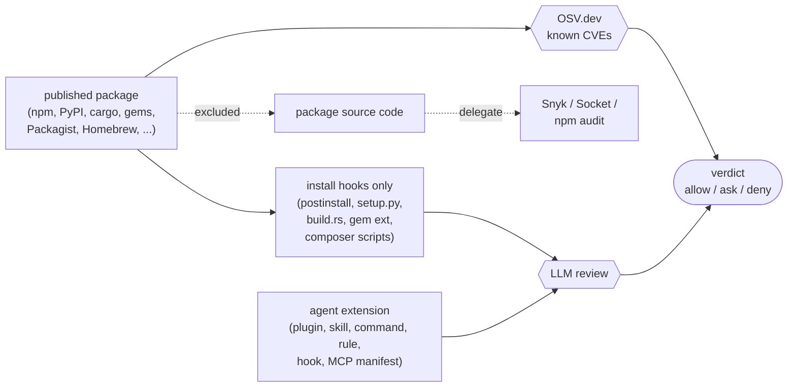

# Security Policy

## Reporting a Vulnerability

Use GitHub's private vulnerability reporting:
[`Maxlemore97/Watchdog` → Security → Report a vulnerability](https://github.com/Maxlemore97/Watchdog/security/advisories/new).

Please include a reproducer, the affected version, and your assessment of impact.
Expect an initial response within 5 working days.

Do **not** open a public issue or PR with exploit details before a fix ships.

## Threat Model

Watchdog gates two things: package installs that an AI agent runs
on your behalf, and the agent extensions loaded next to it. The
trust boundary sits between untrusted artifacts — published
packages, git-cloned plugins, install commands typed by an LLM —
and the machine running the agent.

The host can be Claude Code, Claude Desktop, Cursor, Continue, Zed,
Cline, OpenCode, Aider, or a plain shell. The provider doing the
analyzer review can be `claude`, `gemini`, `openai`, `ollama`, or a
binary plugged in via `WATCHDOG_LLM_CMD`. Nothing below depends on
which host or provider is in use; file names and config paths in
this document are examples, not an exhaustive list.

Four adapters share one engine:

| Adapter | Hooks into |
| --- | --- |
| `watchdog-shim` | Any host that shells out to a package manager (PATH wrapper) |
| `watchdog-mcp` | Any MCP-aware host (native tool call) |
| `watchdog-pretool` / `-session` / `-prompt` | Claude Code hook entry points |
| `watchdog-action` | GitHub PRs touching plugin / skill artifacts |

The binary is static Go; runtime dependencies are stdlib plus
`regexp/RE2`, `archive/tar`, `os/exec`.

### Scope split: OSV vs. LLM

Two checks against two surfaces. An LLM has no edge on known-CVE
lookups, and OSV has no edge on natural-language attack patterns,
so each runs against the surface it's good at. Package source code
goes to neither — that's Snyk / Socket / `npm audit` territory.



**OSV side** — `name@version` goes to OSV.dev; advisories at or
above `WATCHDOG_MIN_SEVERITY` (default `low`) deny. Cached one hour.

**LLM side** — only text where pattern-matched CVE lookups can't
help reaches the model:

- **Agent extensions.** Markdown or JSON files that ship instructions
  to an agent: `.claude-plugin/plugin.json`, `skills/`, `commands/`,
  `agents.md`, `CLAUDE.md`, Cursor rules, Continue config, Zed
  context-server entries, Cline MCP settings, generic MCP server
  manifests, plus the analogous files any other host uses. The
  analyzer looks for prompt injection, hidden instructions, exfil
  patterns, and declared-vs.-actual-tool mismatch.
- **Hooks and agent-side scripts** — shell embedded in JSON or
  Markdown (PreToolUse, on-install, on-load, or whatever a host
  calls them). Intent check on the embedded commands.
- **Plugin / extension manifests** — permissions scope, unexpected
  network calls, install-time writes into agent config directories
  (`~/.claude/`, `~/.cursor/`, `~/.continue/`, `~/.config/zed/`,
  VS Code extension storage).
- **Install hooks in published packages.** `preinstall` /
  `postinstall` in `package.json`, `setup.py`, `build.rs`, gem
  `extconf.rb` and `Rakefile`, composer `pre-/post-install-cmd`,
  Homebrew formula scriptlets. The LLM sees these and nothing
  else from the package. A bundle with no hooks short-circuits to
  `allow` after the OSV pass via route `no_install_hooks`
  (`internal/analyzer/analyzer.go`); whatever else is in the
  package is left to dedicated SCA tools.

### In scope

- **Prompt injection** in fetched artifact files trying to override
  the analyzer's verdict. Defenses: artifact bodies are wrapped in
  `<UNTRUSTED kind="file" path="…">` framing with the path attribute
  HTML-escaped (`escapeHTMLAttr` in `internal/analyzer/analyzer.go`)
  and any literal `</UNTRUSTED` inside the body neutralized; a
  deterministic regex prefilter runs before the LLM; verdict
  extraction accepts the model's output only as a bare JSON object
  or a fenced ```` ```json ```` block. Prose-embedded objects are
  ignored, so a hostile artifact whose contents get echoed back
  cannot smuggle a forged `{"verdict":"allow"}` past the parser.
- **Malicious install commands** crafted to evade parsing. Defenses:
  custom `tokenizeWithOps` lexer in `internal/parsers/` (Go has no
  `shlex` equivalent — the lexer handles quoting, escapes, and the
  shell operators `&&`, `||`, `;`, `|` explicitly), recursive subshell
  extraction with depth cap, fail-`ask` on malformed shell.
- **Hostile archive contents** (zip-slip, symlink-out, oversized
  members). Defenses: explicit safety filter in
  `internal/fetchers/tarsafe.go` rejecting absolute paths, `..`
  components, and any header with `Typeflag == TypeSymlink |
  TypeLink`; downstream readers do `os.Lstat` and check
  `mode & os.ModeSymlink != 0` before reading manifest files; per-file
  `MaxFileBytes` (10 000 bytes) and per-bundle `MaxBundleBytes`
  (50 000 bytes) caps, 5 000 000-byte `MaxDownloadBytes` cap on
  archive fetch — all defined in `internal/fetchers/http.go`.
- **Hostile git repositories** triggering interactive prompts or
  credential leaks during clone. Defenses (all in
  `internal/fetchers/plugin.go`): `GIT_TERMINAL_PROMPT=0`,
  `GIT_ASKPASS=/bin/true`, `GIT_SSH_COMMAND="ssh -o BatchMode=yes -o
  StrictHostKeyChecking=accept-new"`, 20 s `context.WithTimeout`,
  `git clone --depth=1 --filter=blob:none`.
- **Recursive LLM invocation** via hooks triggered from within the
  analyzer's subprocess. Defense: `WATCHDOG_DISABLE=1` set in the
  spawned LLM child's env; every hook entry point short-circuits when
  `config.Disabled()` returns true.
- **OSV / registry network failure** masking a vulnerability.
  Defense: fail-closed default per adapter
  (`WATCHDOG_FAILCLOSED_VERDICT` — `ask` in adapters that can prompt
  the user via the host UI such as in-session hooks or MCP handlers;
  `deny` in the shim and other contexts that have no interactive
  surface), per-call timeouts.
- **DoS via install command fan-out**. Defense:
  `WATCHDOG_MAX_PACKAGES` cap (default 50); larger commands return
  `ask` without scanning.
- **`WATCHDOG_OSV_ENDPOINT` scheme abuse**. Only `http://` / `https://`
  values override the default endpoint; a stray `file://` is rejected
  so `Query` never turns into a local-file read.
- **Tamper with Watchdog's own state.** Defenses: install-time
  `~/.watchdog/manifest.json` recording sha256 of every Watchdog
  binary and shim wrapper, verified on every hot-path call
  (`watchdog-pretool`, `watchdog-shim-exec`, MCP `watchdog_health`);
  Ed25519 signature over the manifest and over short-TTL MCP→shim
  decision tokens using a per-install local keypair
  (`~/.watchdog/.signing.{key,pub}`, modes 0600 / 0644); tamper-pattern
  detector in `internal/parsers/tamper.go` that denies any Bash tool
  call matching `UNSET_PATH`, `PATH_OVERRIDE`, `ABS_PATH_INSTALL`,
  `SETTINGS_JSON_EDIT` (writes to any host's hook / MCP config —
  `~/.claude/settings.json`, `~/.cursor/mcp.json`, the Continue /
  Cline / Zed equivalents), `WATCHDOG_KILL`, or `WATCHDOG_REMOVE`;
  an always-on JSON-lines audit log at `~/.watchdog/audit.jsonl`
  recording every protective and meta-protective event.

### Out of scope

- **Source-code review of published packages beyond install hooks.**
  CVE detection across `node_modules`, transitive deps, and library
  source is OSV / Snyk / Socket / `npm audit` territory; Watchdog
  defers to them. The LLM never sees package source files outside
  the install-hook surfaces listed above. Use a dedicated SCA tool
  if you need that coverage.
- **Local filesystem integrity.** Verdict caches live under
  `WATCHDOG_CACHE_DIR` (default `~/.cache/watchdog`). A local
  attacker with write access there can plant a forged `allow`
  verdict. Defense belongs to the host's filesystem permissions, not
  Watchdog.
- **Filesystem-write attackers who can read
  `~/.watchdog/.signing.key` and re-sign forged state.** Local
  signing is *detection*, not prevention. The release-time
  baseline (`integrity.BaselinePubKey` stamped via `-ldflags`,
  verifying `~/.watchdog/baseline.json` against a CI-held key) raises
  the bar to "swap the binary with one signed by the Watchdog
  maintainer's release keypair" — but the goreleaser hook that
  actually signs `baseline.json` is the next step. Unstamped builds
  (`go install` without ldflags) skip baseline verification silently.
- **Compromised LLM provider CLIs.** Watchdog shells out to whichever
  provider is configured (`claude`, `gemini`, `openai`, `ollama`, or
  a user-supplied generic CLI via `WATCHDOG_LLM_CMD`). If the CLI
  binary itself is compromised, Watchdog has no defense.
- **SSRF / private-network probing via `fetch_plugin_git`.**
  Watchdog passes user-provided `https://` / `git@` / `ssh://` URLs
  to `git clone`. Internal-network URLs will attempt to clone and
  fail; no payload is executed, but this is not a hardened network
  sandbox.
- **Side-channel and timing attacks** against the analyzer cache.
- **Kernel-level attacks** (container escape, ptrace, /proc
  inspection).

### Known limitations

- **Wheel-only PyPI packages**: no sdist available → no `setup.py`
  to inspect, so the install-hook bundle is empty and the analyzer
  short-circuits to `allow` after the OSV pass (route
  `no_install_hooks`). Modern wheels execute no install-time code
  by design; if you need source-level review of a wheel-only
  package, run Snyk/Socket against it — that surface is explicitly
  out of Watchdog's scope.
- **Prefilter is regex-based** (`regexp` / RE2 — no backrefs, no
  lookahead), not exhaustive. Patterns target high-signal indicators
  (PEM keys, AWS / GitHub / OpenAI-Anthropic / Slack token shapes,
  `curl … | sh`, `env | curl`). Bypass is possible with obfuscation;
  the LLM stage backstops.
- **LLM verdicts are non-deterministic.** Cache is content-addressed
  via `bundle.UpstreamDigest` plus `(provider, model,
  sha256(SystemPrompt), ecosystem, name, version)`. Unchanged bytes
  hit cache regardless of wall clock; `WATCHDOG_LLM_CACHE_TTL`
  (default 30 days) bounds worst-case staleness as a paranoia floor.
  Switching provider, model, or editing the system prompt all
  invalidate prior verdicts. `ask` verdicts are not persisted — the
  next call re-rolls, which converges over time and avoids freezing a
  coin-flip into the cache. Republished `name@version` (e.g. npm's
  72-hour unpublish window) is caught by digest mismatch on the next
  fetch.
- **README / docs files** that document `curl … | sh` install
  patterns surface as `ask` rather than `deny` (`isDocPath` in
  `internal/analyzer/analyzer.go` classifies `README*`, `*.md`,
  `*.rst`, `*.txt`). Code/script files keep the deny semantics.
  Trade-off: a hostile package whose payload lives only in
  `README.md` (no executable file with the same signature) will
  reach the LLM stage as `ask`; the LLM is the backstop for that
  path.
- **`policy.WorstVerdict`** normalizes any non-canonical input
  string to `ask` (matching the `Rank` collapse for unknown
  verdicts). Callers that compare the result by string see only
  `allow` / `ask` / `deny`.
- **Tamper baseline is scaffolded, not signed yet.** The
  `internal/integrity` verification path ships today; CI release
  signing of `baseline.json` is a follow-up.

## Defense Layers

1. **Parser** (`internal/parsers/`): only known package managers +
   subcommands trigger a scan; malformed shell → `ask`. Bash tool
   calls additionally pass through the tamper-pattern detector.
2. **OSV.dev cross-check** (`internal/osv/`): known CVEs at or
   above `WATCHDOG_MIN_SEVERITY` (default `low`) deny.
3. **Deterministic prefilter** (`internal/analyzer/Prefilter`):
   matches against a small set of high-signal patterns; deny on
   code-file hits, ask on doc-only hits.
4. **LLM review** (`internal/analyzer/AnalyzePackage`,
   `AnalyzeLocalPlugin`). Published packages: only install-hook
   surfaces reach the model (`package.json#scripts`, `setup.py`,
   `build.rs`, gem ext, composer scripts, Homebrew scriptlets); a
   bundle with none of those short-circuits to `allow` via route
   `no_install_hooks`. Agent extensions: full text body — Markdown
   plugin / skill / command / rule / agent files plus host-side
   hook scripts. The system prompt frames artifact content as
   `<UNTRUSTED>` data; the analyzer accepts a verdict only as a
   bare JSON object or a fenced ```` ```json ```` block. Verdicts
   cache under
   `sha256(provider, model, sha256(SystemPrompt), ecosystem, name,
   version, bundle.UpstreamDigest)` — content-addressed, so
   unchanged bytes hit cache regardless of wall clock and byte
   changes (republished `name@version`, fetcher-curation update)
   force a re-run. `WATCHDOG_LLM_CACHE_TTL` (default 30 days) is a
   paranoia floor, not a freshness signal. `ask` verdicts are not
   persisted; the next call re-rolls.
5. **Integrity verification** (`internal/integrity`, called on every
   hot path): sha256 manifest + Ed25519 signature; install-shaped
   Bash is denied on mismatch.
6. **MCP handler guard** (`internal/mcp/Guard`): panic recovery,
   per-tool timeout (`WATCHDOG_MCP_HANDLER_TIMEOUT`, default 60 s),
   audit-log entries on start / ok / error / panic / timeout.
7. **Audit log** (`internal/audit`): tamper and integrity events at
   `~/.watchdog/audit.jsonl` for post-incident `jq`.
8. **Fail-closed defaults**: missing CLI / network failure →
   `WATCHDOG_FAILCLOSED_VERDICT` (`ask` in adapters with an
   interactive host UI, `deny` in the shim and other non-interactive
   contexts); never silent allow.

## Disclosure Policy

We aim to fix critical issues within 14 days and ship a coordinated
release. Reporters credited in the release notes unless they request
anonymity.
